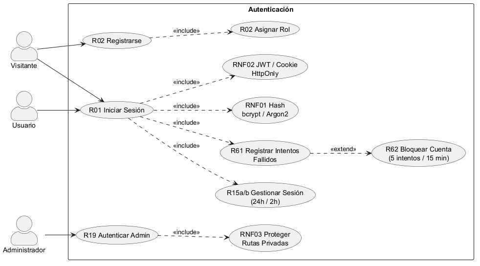

# **CU-01 - Módulo Autenticación y Sesiones**

## 1. Nombre

- **Autenticación y Sesiones**

## 2. Actores

- Usuario
- Visitante
- Administrador

## 3. Objetivos

- Iniciar sesión
- Crear una cuenta

## 4. Precondiciones

- Para iniciar sesión se requiere de una cuenta registrada.

## 5. Postcondiciones

- Usuario autenticado
- Cuenta de usuario creada