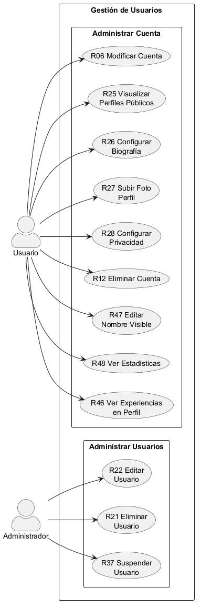

# **CU-02 - Módulo Gestión de Usuarios**

## 1. Nombre

- **Administrar Cuenta**
- **Administrar Usuarios**

## 2. Actores

- Usuario
- Administrador

## 3. Objetivos

- Editar una cuenta
- Eliminar una cuenta
- Suspender una cuenta

## 4. Precondiciones

- Para editar, eliminar y suspender una cuenta se requiere que esté registrada.

## 5. Postcondiciones

- Cuenta editada
- Cuenta eliminada
- Cuenta suspendida