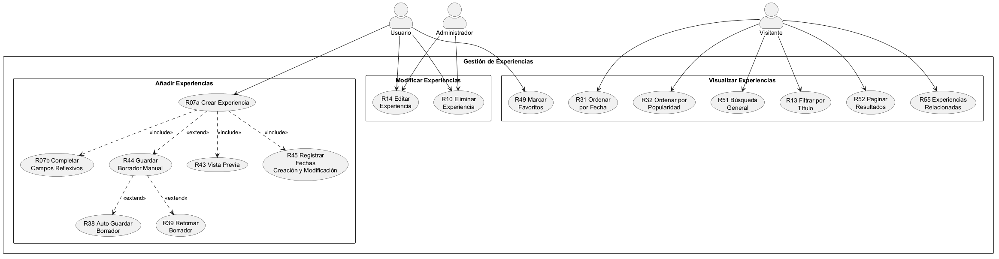

# **CU-03 Módulo Gestión de Experiencias**

## 1. Nombre

- **Añadir Experiencias**
- **Modificar Experiencias**
- **Visualizar Experiencias**

## 2. Actores

- Usuario
- Visitante
- Administrador

## 3. Objetivos

- Añadir una experiencia
- Editar una experiencia
- Eliminar una experiencia
- Filtrar experiencias

## 4. Precondiciones

- Para editar, eliminar y filtrar una experiencia se requiere que esté creada.

## 5. Postcondiciones

- Experiencia añadida
- Experiencia editada
- Experiencia eliminada
- Experiencias filtradas