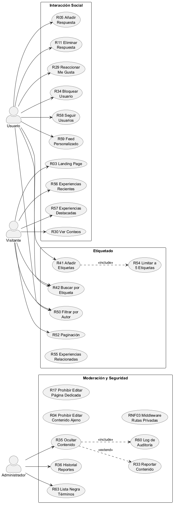

# **CU-04-05 - Interacción Social, Etiquetado y Moderación**

## 1. Nombre

- **Interacción Social**
- **Etiquetado**
- **Moderación y Seguridad**

## 2. Actores

- Usuario
- Visitante
- Administrador

## 3. Objetivos

- Añadir una respuesta a una experiencia
- Seguir a un usuario
- Bloquear a un usuario
- Reaccionar a una experiencia
- Crear una etiqueta
- Asociar etiqueta a una experiencia
- Filtrar experiencias por etiqueta
- Ocultar contenido

## 4. Precondiciones

- Para responder a una experiencia se requiere que la experiencia esté creada.
- Para seguir o bloquear a un usuario se requiere que el usuario esté creado.
- Para reaccionar a una experiencia se requiere que la experiencia esté creada.
- Para asociar una etiqueta a una experiencia se requiere que la experiencia esté creada.

## 5. Postcondiciones

- Respuesta a experiencia creada
- Usuario seguido
- Usuario bloqueado
- Reacción a experiencia creada
- Etiqueta añadida
- Etiqueta asociada a experiencia
- Contenido ocultado