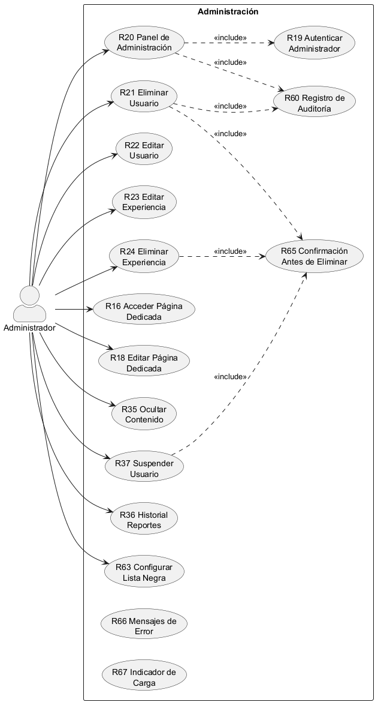

# **CU-06 Administración del Sistema**

## 1. Nombre

- **Administración del Sistema**

## 2. Actores

- Administrador

## 3. Objetivos

- Editar usuarios
- Eliminar usuarios
- Editar experiencias
- Eliminar experiencias
- Editar página dedicada

## 4. Precondiciones

- Para editar y eliminar una experiencia se requiere que esté creada.
- Para editar y eliminar una cuenta se requiere que esté registrada.

## 5. Postcondiciones

- Cuenta editada
- Cuenta eliminada
- Experiencia editada
- Experiencia eliminada
- Página dedicada editada