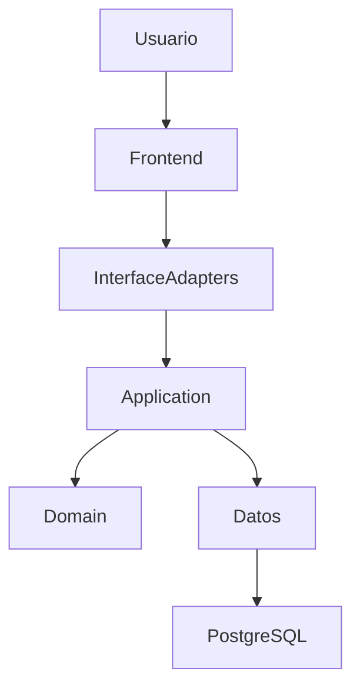

# **Architecture Overview**

## 1. Propósito del Sistema

El sistema `EthosPlatfform` consiste en una plataforma web comunitaria
que permite a sus usuarios registrarse, autenticarse y compartir
experiencias personales estructuradas relacionadas con reflexiones
éticas y morales. La plataforma combina características de un blog
social con las de una comunidad interactiva, incorporando:

- Publicación de experiencias con campos reflexivos sobre moral y ética
  personal.
- Interacción comunitaria: respuestas (un solo nivel), reacciones "me
  gusta" y favoritos.
- Sistema de etiquetado, búsqueda y paginación de contenidos.
- Feed personalizado basado en usuarios seguidos.
- Panel de administración con herramientas de moderación y gestión.
- Seguridad: autenticación JWT/sesiones, cifrado de contraseñas, bloqueo
  por intentos fallidos.

## 2. Objetivos Arquitectónicos

- **Medio y alto Rendimiento**
- **Bajo Acoplamiento**
- **Separación de Responsabilidades**
- **Escalabilidad horizontal futura**
- **Compatibilidad**
- **Facilidad de Pruebas**

## 3. Arquitectura General

La aplicación utiliza:

- Client-Server Architecture
- Component Based Architecture
- Vertical Slice Architecture
- Clean Architecture

## 4. Componentes Principales

| Componente        | Responsabilidad              |
| ----------------- | ---------------------------- |
| Presentación / Frontend      | Interfaz de usuario          |
| InterfaceAdapters               | Entrada y Salida HTTP / Middleware                 |
| Application Layer | Casos de uso                 |
| Domain Layer      | Reglas de negocio            |
| Datos    | Persistencia e integraciones |
| PostgreSQL        | Persistencia                 |

## 5. Flujo de Alto Nivel

## 6. Restricciones Arqutectonicas

- No existe comunicación de capas o módulos inferiores a superiores.
- Las comunicaciones se gestionan mediante interfaces.
- Toda lógica de negocio debe vivir en `Domain`.
- `Datos` nunca debe depender del `Frontend`, `Application`, `InterfaceAdapters` y `Domain`.
- `InterfaceAdapters` es el punto de entrada y salida de las peticiones.
- `Application` orquesta operaciones.
- `Datos` accede a la base de datos y a servicios externos.