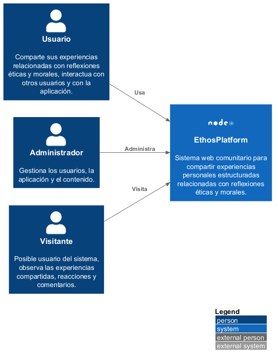

# **C1 - Context**

## 1. Actores

- **Usuario**
- **Administrador**
- **Visitante**

## 2. Sistemas Externos

Para el presente proyecto no es necesario integrar con algún sistema externo.

No se considera a la base de datos como un sistema externo, ya que esta se encontrara junto al sistema en la misma máquina al momento del despliegue.

## 3. Responsabilidades Generales

- **Usuario**: Este comparte sus experiencias relacionadas con reflexiones éticas y morales, escribe comentarios, reacciona en otras experiencias compartidas e interactúa con otros usuarios mediante seguidos.
- **Administrador**: Se encarga de gestionar los usuarios (eliminación, suspensión y edición), la aplicación en general, el contenido que se sube y la página principal de la aplicación.
- **Visitante**: Aún no está registrado al sistema, solo puede ver las experiencias compartidas, buscar experiencias, buscar usuarios y ver tendencias.
- **EthosPlatform**: Sistema web comunitario para compartir experiencias personales estructuradas relacionadas con reflexiones éticas y morales.