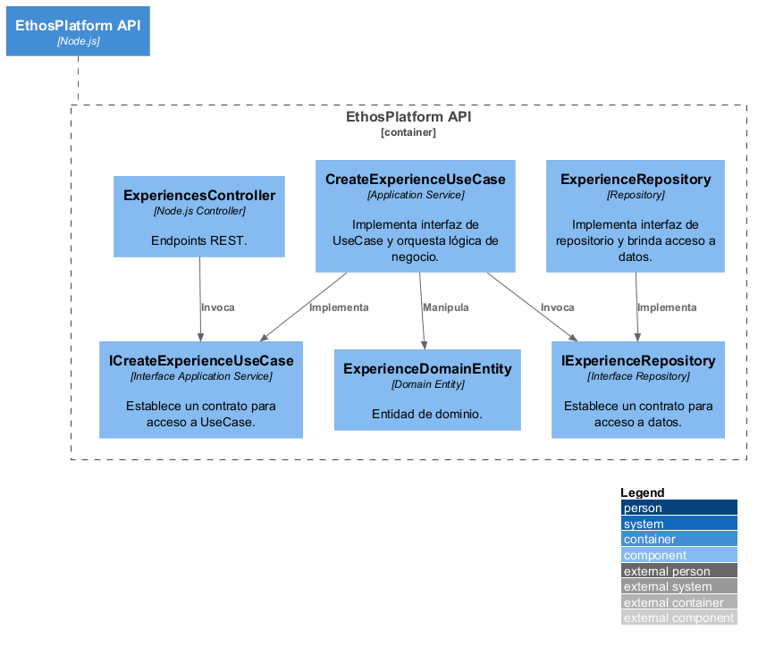
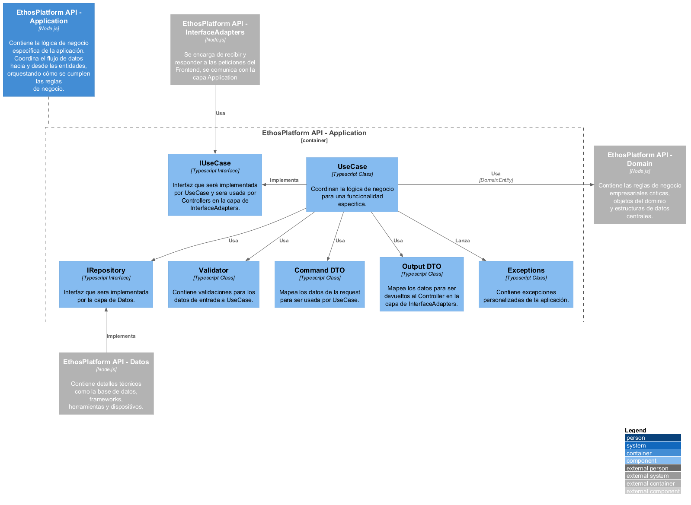
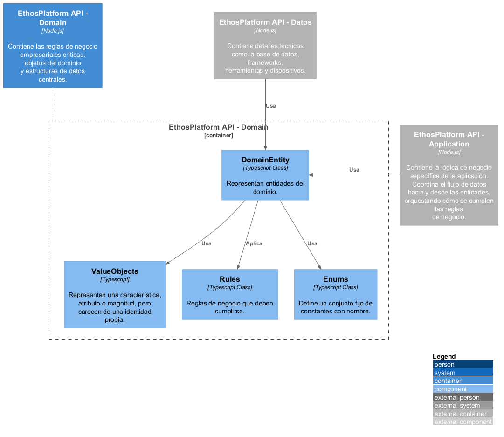
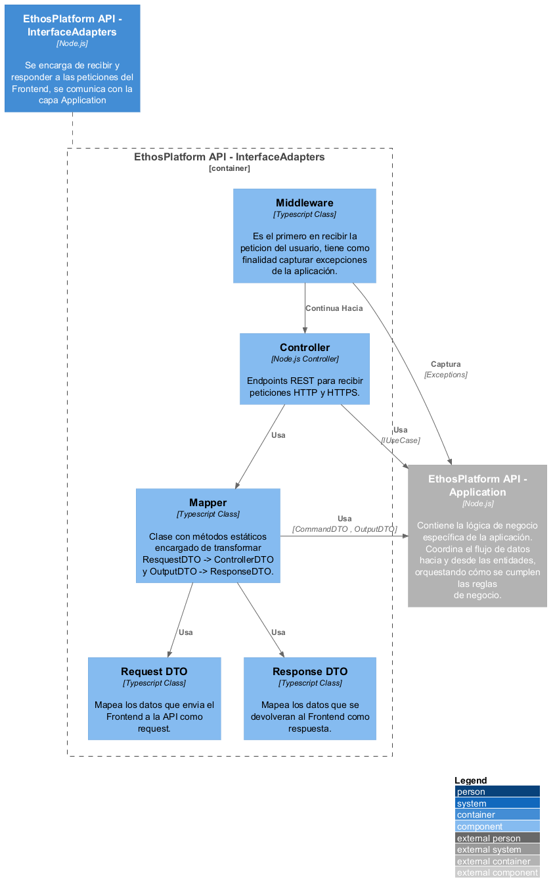
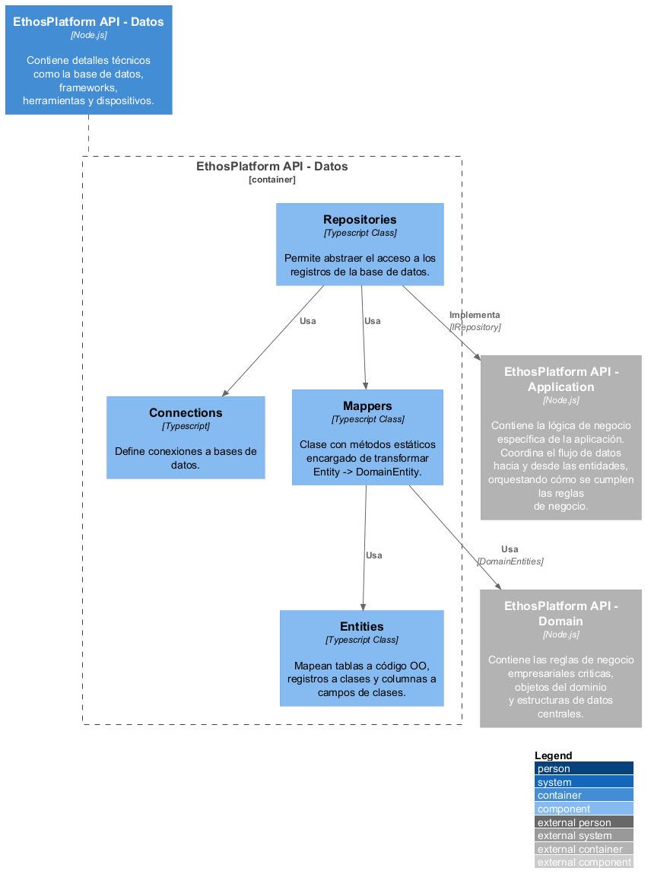

# **C3 - Component - Backend**

## 1. Capa de Lógica

### 1.1. Capa `Application`

- **UseCase**: Orquestan flujos para cumplir con una funcionalidad especifica de la aplicación.
- **IUseCase**: Interfaces que son implementadas por los `UseCase` y que son usadas por los `Controllers` en la capa de `InterfaceAdapters` para desacoplamiento.
- **IRepository**: Interfaces usadas por los `UseCase` para acceso a datos, estas son implementadas por la capa de `Datos`, sirven para desacoplar la lógica de componentes externos de la capa `Application`,
- **Validator**: Contiene validaciones de inputs para todo elemento `Command DTO` antes que ingrese al `UseCase`.
- **Command DTO**: Mapea los datos de `Request DTO` de la capa de `InterfaceAdapters`.
- **Output DTO**: Mapea los resultados de `UseCase` para ser enviados de vuelta a la capa de `InterfaceAdapters`.
- **Exceptions**: Contiene excepciones personalizadas de la aplicación relacionadas con validación de inputs.

### 1.2. Capa `Domain`

- **DomainEntity**: Entidades del dominio.
- **Rules**: Contiene reglas propias del núcleo del negocio que deben validarse.
- **ValueObjects**: Son características o atributos que carecen de una identidad propia. Útil para campos como `Email` que requieren validaciones y comprobaciones aparte.
- **Enums**: Conjunto fijo de constantes con nombre. Útil para campos como `Status`

### 1.3. Capa `InterfaceAdapters`

- **Middleware**: Interceptan la petición original del usuario antes de pasarla al siguiente componente, sirve para insertar lógica transversal como validaciones, captura de excepciones o logging. 
- **Controller**: Controladores `API REST` que recibirán las peticiones del Frontend, usan métodos `HTTP` (GET, POST, PUT y DELETE).
- **Mappers**: Se encargan de transformar entre `DTOs` de diferentes capas, en este caso transforman Request DTO (`InterfaceAdapters`) a Command DTO (`Application`) y Output DTO (`Application`) a Response DTO (`InterfaceAdapters`).
- **Request DTO**: Mapean los datos de las peticiones del Frontend.
- **Response DTO**: Mapean los resultados que serán devueltos al Frontend.

## 2. Capa de Datos

- **Connections**: Definen conexiones a bases de datos específicos.
- **Entities**: Clases TypeScript que representan tablas de la base de datos, son manejados por los `ORM`.
- **Mappers**: Se encargan de transformar entre `DTOs` de diferentes capas, en este caso transforman Entities del `ORM` a Domain Entities (Entidades del Dominio). 
- **Repositories**: Se usa este patrón de diseño para abstraer la lógica de consulta a los registros de la base de datos, estos se encargan de implementar las Interfaces definidas en la capa de `Application` (`IRepositories`).