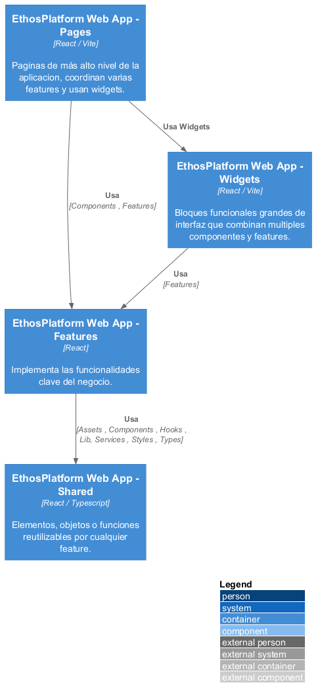
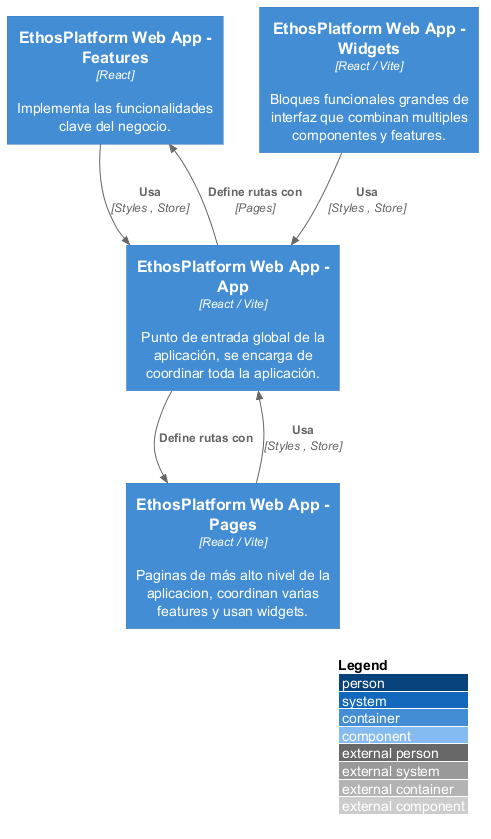
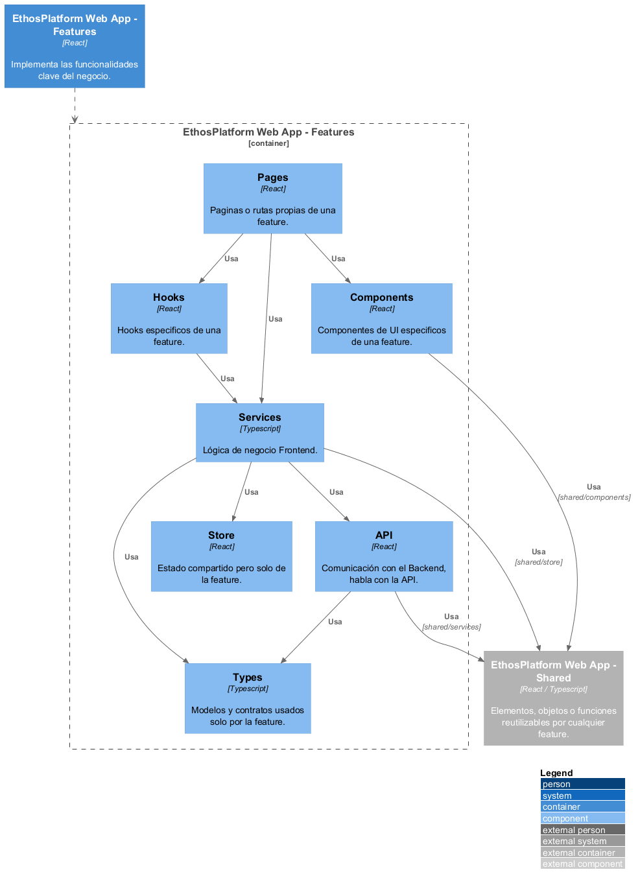
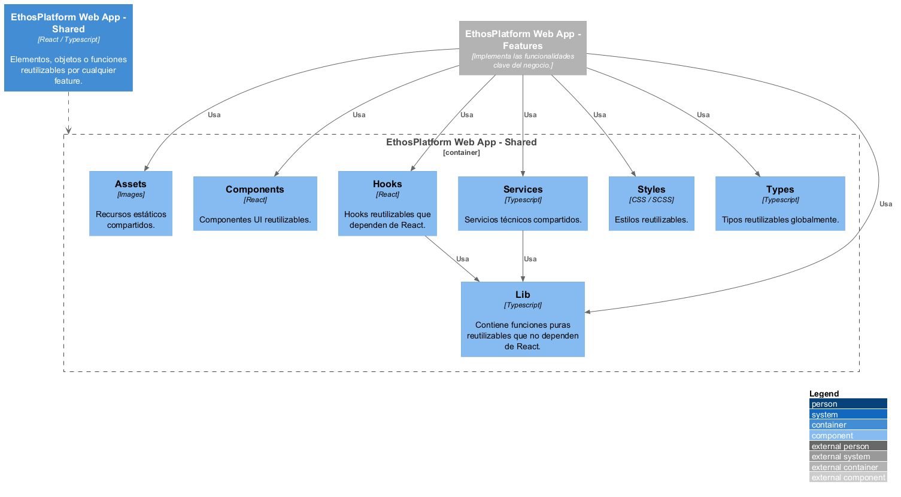

# **C3 - Component - Frontend**

## 1. Capa `Presentación`

### 1.1. `app`

Contiene el punto de entrada principal a la aplicación, además de contener recursos y estados globales.

- Se comunica con `pages` y `features` (`features/<feature>/pages`) para definir `routes`.

### 1.2. `features`

- **Pages**: Son páginas o rutas (/login, /experiencia) que pertenecen a una única `feature`.
- **Hooks**: En el `Frontend`, sirven para enganchar características de `React` desde componentes funcionales, como `useState` o `useEffect`.
- **Components**: Pedazos muy pequeños de UI que son específicos de una `feature`.
- **Services**: Orquesta la lógica de negocio del Frontend.
- **Store**: Contiene o almacena el estado de una `feature`.
- **Api**: Se comunica con el Backend.
- **Types**: Son modelos o contratos que son usados solo por la `feature` actual.

### 1.3. `pages`

- `pages` usa los `styles` y `store` global definidos aquí en `app`.

### 1.4. `shared`

- **Assets**: Es cualquier recurso estático compartido y usado por cualquier `feature`.
- **Components**: Son pedazos pequeños de UI reutilizables por varias `feature`.
- **Hooks**: Cumplen la misma función que los `Hooks` en `features`, pero con la diferencia de que estos pueden ser usados por cualquier `feature`.
- **Services**: Son servicios técnicos compartidos como Axios, Fetch Client, Storage Service, Logger, etc.
- **Styles**: Estilos (variables, colores, temas, tipografía, etc.) que pueden ser usados por cualquier `feature`. A diferencia del `styles` en `app`, el `styles` de `shared` no afecta de manera global a la aplicación.
- **Types**: Contiene tipos reutilizables de forma global.
- **Lib**: Contiene funciones puras reutilizables que no dependen de React, como funciones de formato, cálculo, etc.

### 1.5. `widgets`

Son bloques grandes de UI las cuales abarcan múltiples `features`.

- `widgets` usa los `styles` y `store` global definidos aquí en `app`.