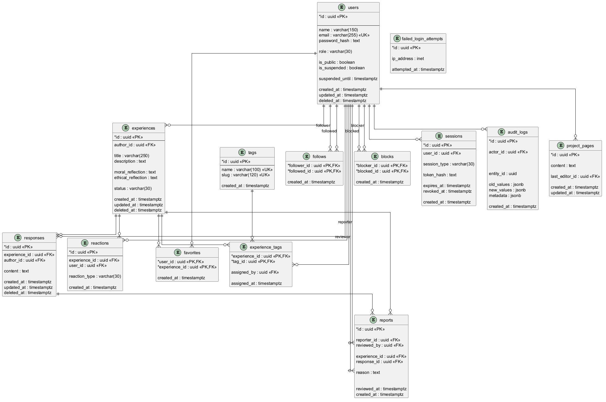

# **Relational Model**

## Usuarios

- **Entidad**: Usuarios
- **Tabla**: users
- **Propósito**: Almacenar la informacion de los usuarios del sistema.
- **PK**: id
- **FK**: 
- **Índices**:

## Experiencia

- **Entidad**: Experiencia
- **Tabla**: experiences
- **Propósito**: Almacenar la información de las experiencias compartidas por los usuarios del sistema.
- **PK**: id
- **FK**: author_id
- **Índices**:

## Etiqueta

- **Entidad**: Etiqueta
- **Tabla**: tags
- **Propósito**: Almacenar la información de las diferentes etiquetas que se pueden asociar a las experiencias.
- **PK**: id
- **FK**: 
- **Índices**: