# **Arquitectura del Monorepo**

> Esta guía explica **qué es cada carpeta**, **por qué existe**, **qué problemas resuelve**, **qué dependencias puede tener**, **qué dependencias no debería tener**, y responde dudas comunes que suelen aparecer cuando un proyecto empieza a crecer.

- [**Arquitectura del Monorepo**](#arquitectura-del-monorepo)
- [1. ¿Por qué un Monorepo?](#1-por-qué-un-monorepo)
- [2. Vista General](#2-vista-general)
- [3. Relación entre carpetas](#3-relación-entre-carpetas)
- [4. Carpetas](#4-carpetas)
  - [4.1. `apps/`](#41-apps)
    - [4.1.1. ¿Qué representa?](#411-qué-representa)
    - [4.1.2. ¿Por qué existe?](#412-por-qué-existe)
    - [4.1.3. ¿Puedo poner código reutilizable aquí?](#413-puedo-poner-código-reutilizable-aquí)
  - [4.2. `packages/`](#42-packages)
    - [4.2.1. ¿Qué es un Package?](#421-qué-es-un-package)
    - [4.2.2. ¿Por qué no poner todo dentro de frontend o backend?](#422-por-qué-no-poner-todo-dentro-de-frontend-o-backend)
    - [4.2.3. `packages/types`](#423-packagestypes)
      - [4.2.3.1. ¿Qué contiene?](#4231-qué-contiene)
      - [4.2.3.2. ¿Por qué existe?](#4232-por-qué-existe)
      - [4.2.3.3. Regla importante](#4233-regla-importante)
      - [4.2.3.4. ¿Puedo importar React aquí?](#4234-puedo-importar-react-aquí)
    - [5.2.4. `packages/shared`](#524-packagesshared)
      - [5.2.4.1. ¿Qué contiene?](#5241-qué-contiene)
      - [5.2.4.2. ¿Por qué existe?](#5242-por-qué-existe)
      - [4.2.4.3. ¿Puedo acceder a la base de datos desde `shared`?](#4243-puedo-acceder-a-la-base-de-datos-desde-shared)
      - [4.2.4.4. Regla práctica](#4244-regla-práctica)
    - [5.2.5. `packages/ui`](#525-packagesui)
      - [5.2.5.1. ¿Qué contiene?](#5251-qué-contiene)
      - [5.2.5.2. ¿Por qué existe?](#5252-por-qué-existe)
      - [5.2.5.3. ¿Puede UI llamar APIs?](#5253-puede-ui-llamar-apis)
    - [5.2.6. Dependencias permitidas](#526-dependencias-permitidas)
    - [5.2.7. Dependencias prohibidas](#527-dependencias-prohibidas)
  - [4.3. `tests/`](#43-tests)
    - [4.3.1. ¿Por qué existe fuera de apps?](#431-por-qué-existe-fuera-de-apps)
    - [4.3.2. `tests/e2e`](#432-testse2e)
      - [4.3.2.1. ¿Qué contiene?](#4321-qué-contiene)
      - [4.3.2.2. Flujo](#4322-flujo)
      - [4.3.2.3. ¿Por qué no poner `e2e` dentro del frontend?](#4323-por-qué-no-poner-e2e-dentro-del-frontend)
      - [4.3.2.4. Dependencias permitidas](#4324-dependencias-permitidas)
      - [4.3.2.5. Dependencias prohibidas](#4325-dependencias-prohibidas)
- [5. Regla de Dependencias del Monorepo](#5-regla-de-dependencias-del-monorepo)
- [6. Preguntas Frecuentes](#6-preguntas-frecuentes)
  - [6.1. ¿Dónde pongo DTOs?](#61-dónde-pongo-dtos)
  - [6.2. ¿Dónde pongo utilidades compartidas?](#62-dónde-pongo-utilidades-compartidas)
  - [6.3. ¿Dónde pongo componentes reutilizables?](#63-dónde-pongo-componentes-reutilizables)
  - [6.4. ¿Dónde pongo lógica de negocio?](#64-dónde-pongo-lógica-de-negocio)
  - [6.5. ¿Dónde pongo llamadas HTTP?](#65-dónde-pongo-llamadas-http)
  - [6.6. ¿Dónde pongo `Playwright`?](#66-dónde-pongo-playwright)
  - [6.7. ¿Dónde pongo configuraciones compartidas?](#67-dónde-pongo-configuraciones-compartidas)


---

# 1. ¿Por qué un Monorepo?

Antes de analizar las carpetas, es importante entender por qué existe esta estructura.

Sin monorepo normalmente se tiene:

```text
frontend-repo/
backend-repo/
shared-types-repo/
ui-library-repo/
```

Esto genera problemas:

* Versionado entre repositorios.
* Duplicación de código.
* Contratos API desincronizados.
* Dependencias difíciles de mantener.
* Múltiples pipelines CI/CD.

El monorepo centraliza todo:

```text
root/
│
├── apps/
├── packages/
└── tests/
```

Permitiendo que todos los proyectos evolucionen juntos.

---

# 2. Vista General

```text
root
│
├── apps
│   ├── backend
│   └── frontend
│
├── packages
│   ├── shared
│   ├── types
│   └── ui
│
└── tests
    └── e2e
```

---

# 3. Relación entre carpetas

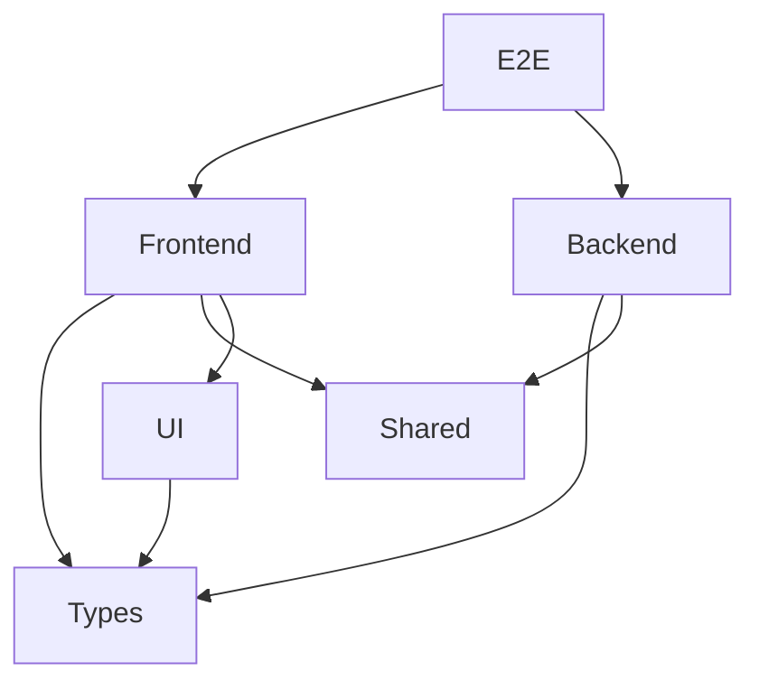

Se observa que:

* Backend y Frontend pueden compartir código.
* UI depende de Types.
* E2E prueba el sistema completo.
* Backend nunca debería depender de UI.

---

# 4. Carpetas

## 4.1. `apps/`

```text
apps/
├── backend
└── frontend
```

### 4.1.1. ¿Qué representa?

Aplicaciones ejecutables.

Si una carpeta puede arrancarse con algo similar a:

```bash
pnpm dev
```

o

```bash
pnpm start
```

Entonces probablemente pertenece a `apps`.

---

### 4.1.2. ¿Por qué existe?

Porque una aplicación tiene un ciclo de vida propio:

* Se ejecuta.
* Se despliega.
* Tiene configuración.
* Tiene variables de entorno.

---

### 4.1.3. ¿Puedo poner código reutilizable aquí?

No se puede poner código reutilizable en `apps/`.

Si por ejemplo esto está mal en el backend:

```text
apps/
└── backend/
    └── utils/
```

Si ese código también será usado por frontend. Es mejor:

```text
packages/
└── shared/
```

---

## 4.2. `packages/`

Esta suele ser la carpeta más importante y también la más malentendida.

```text
packages/
├── shared
├── types
└── ui
```

---

### 4.2.1. ¿Qué es un Package?

Un package es una unidad reutilizable.

Por ejemplo:

```typescript
// formatear fechas
import { formatDate } from "@packages/shared";
```

o

```typescript
// DTO para animal
import { AnimalDto } from "@packages/types";
```

o

```typescript
// boton
import { Button } from "@packages/ui";
```

---

### 4.2.2. ¿Por qué no poner todo dentro de frontend o backend?

Porque aparecería duplicación.

Por ejemplo, si en el Backend se tiene:

```typescript
// Esto sirve para recibir datos en backend
interface AnimalDto {
  id: number;
  nombre: string;
}
```

Pero en Frontend se tiene algo similar:

```typescript
// Esto sirve para mapear los datos del usuario para
// enviarlos al Backend
interface AnimalDto {
  id: number;
  nombre: string;
}
```

Entonces se tienen dos copias, esto con el tiempo puede generar inconsistencias:

```typescript
// Cambio en Frontend
Frontend:
{
  id,
  nombre,
  especie
}

// Cambio no hecho en Backend, provocará un fallo
Backend:
{
  id,
  nombre
}
```

---

### 4.2.3. `packages/types`

```text
packages/
└── types
```

---

#### 4.2.3.1. ¿Qué contiene?

Contiene tipos compartidos. Por ejemplo:

```typescript
AnimalDto
UserDto
CreateTenantRequest
LoginResponse
ApiResponse<T>
```

---

#### 4.2.3.2. ¿Por qué existe?

Para mantener contratos sincronizados.

**Sin types**

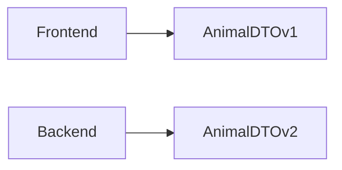

Posibles errores.

---

***Con types***

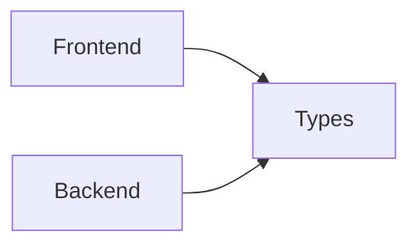

Existe una sola fuente de verdad.

---

#### 4.2.3.3. Regla importante

Debe contener únicamente:

```text
interfaces
types
enums
```

---

**Correcto**

```typescript
export interface AnimalDto {
  id: number;
}
```

---

**Incorrecto**

```typescript
export function saveAnimal() {}
```

Esto pertenece a otro package.

---

#### 4.2.3.4. ¿Puedo importar React aquí?

No puedes importar React aquí, ya que `types` debe ser completamente independiente.

---

### 5.2.4. `packages/shared`

```text
packages/
└── shared
```

---

#### 5.2.4.1. ¿Qué contiene?

Contiene código reutilizable. Por ejemplo:

```text
helpers
validators
constants
formatters
utilities
```

---

**Ejemplo**

```typescript
// Funcion para formatear moneda
// puede ser usada por frontend o backend
export function formatCurrency(value:number){
    return `$${value}`
}
```

---

#### 5.2.4.2. ¿Por qué existe?

Porque frontend y backend suelen repetir lógica.

---

**Sin shared**

Frontend:

```typescript
formatDate()
```

Backend:

```typescript
formatDate()
```

Dos implementaciones que hacen lo mismo.

---

**Con shared**

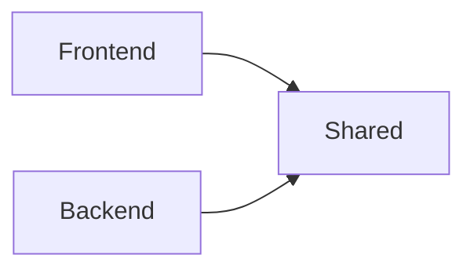

Existe una única implementación.

---

#### 4.2.4.3. ¿Puedo acceder a la base de datos desde `shared`?

No se puede acceder a BD desde `shared`. Esto está mal:

```typescript
import prisma from "...";
```

Porque frontend también debería poder usarlo, pero frontend solo se encarga de la UI no de acceder a la BD.

---

#### 4.2.4.4. Regla práctica

Si el código puede ejecutarse tanto en navegador como en `Node.js` va en `shared`. Si no puede va solo en `backend` o `frontend`.

---

### 5.2.5. `packages/ui`

```text
packages/
└── ui
```

---

#### 5.2.5.1. ¿Qué contiene?

Contiene componentes visuales reutilizables. Por ejemplo:

```text
Button
Modal
Table
Input
```

---

#### 5.2.5.2. ¿Por qué existe?

Imagina que en el futuro se añade:

```text
frontend-admin
frontend-mobile
frontend-public
```

Todos terminarán usando los mismos componentes de forma repetida en cada `frontend`.

---

**Sin UI**

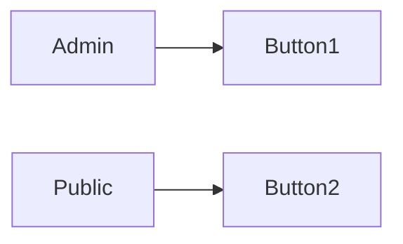

Duplicación.

---

**Con UI**

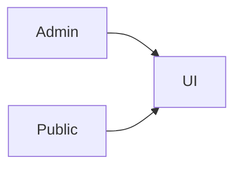

Reutilización.

---

#### 5.2.5.3. ¿Puede UI llamar APIs?

Por lo general no. Esto está mal:

```text
Button -> Login API
```

Pero esto está bien:

```text
Button -> Renderizar botón
```

---

### 5.2.6. Dependencias permitidas

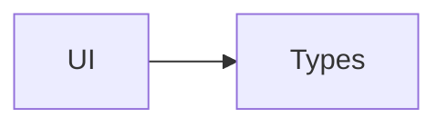

---

### 5.2.7. Dependencias prohibidas

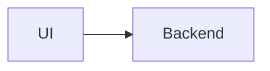

Nunca.

---

## 4.3. `tests/`

```text
tests/
└── e2e
```

Esta carpeta suele generar muchas dudas.

---

### 4.3.1. ¿Por qué existe fuera de apps?

Porque prueba el sistema completo, no prueba únicamente backend o frontend, sino que prueba ambos.

---

### 4.3.2. `tests/e2e`

```text
tests/
└── e2e
```

---

#### 4.3.2.1. ¿Qué contiene?

Contiene escenarios reales. Por ejemplo:

```text
Login
Crear Experiencia
Registrar Usuario
Reaccionar a una Experiencia
```

---

#### 4.3.2.2. Flujo

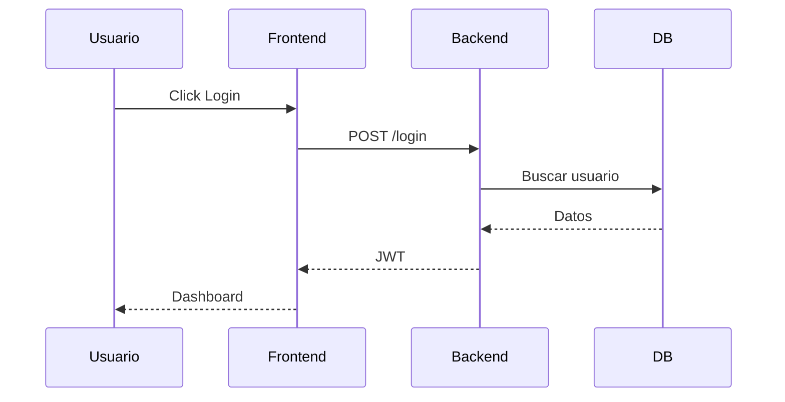

`E2E` verifica todo ese flujo.

---

#### 4.3.2.3. ¿Por qué no poner `e2e` dentro del frontend?

Porque la prueba no pertenece al frontend, y tampoco pertenece al backend, pertenece al sistema.

---

**Correcto**

```text
tests/
└── e2e
```

---

**Incorrecto**

```text
frontend/
└── tests/
    └── e2e
```

---

#### 4.3.2.4. Dependencias permitidas

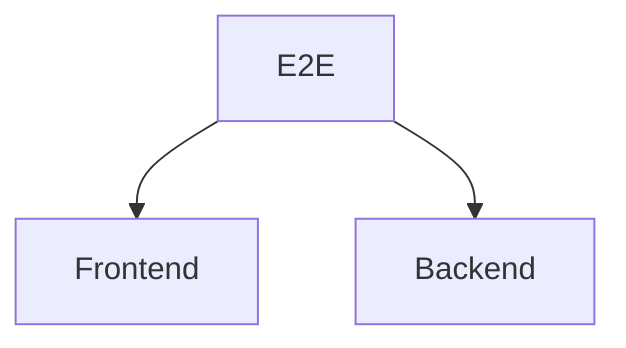

---

#### 4.3.2.5. Dependencias prohibidas

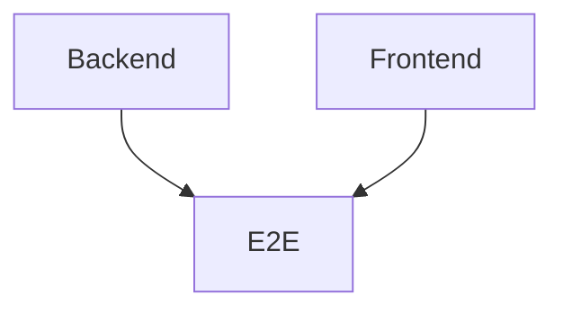

Las aplicaciones nunca deberían depender de las pruebas.

---

# 5. Regla de Dependencias del Monorepo


---

# 6. Preguntas Frecuentes

## 6.1. ¿Dónde pongo DTOs?

```text
packages/types
```

---

## 6.2. ¿Dónde pongo utilidades compartidas?

```text
packages/shared
```

---

## 6.3. ¿Dónde pongo componentes reutilizables?

```text
packages/ui
```

---

## 6.4. ¿Dónde pongo lógica de negocio?

```text
apps/backend
```

---

## 6.5. ¿Dónde pongo llamadas HTTP?

```text
apps/frontend
```

---

## 6.6. ¿Dónde pongo `Playwright`?

```text
tests/e2e
```

---

## 6.7. ¿Dónde pongo configuraciones compartidas?

Cuando el proyecto crezca, normalmente aparece un cuarto `package`:

```text
packages/
├── shared
├── types
├── ui
└── config
```

para centralizar todas las configuraciones y evitar duplicación de configuración:

```text
eslint
prettier
tsconfig
vite
vitest
jest
```

---

Si una carpeta puede ser utilizada por más de una aplicación, probablemente pertenece a `packages`.

Si una carpeta representa un sistema que se ejecuta por sí mismo, pertenece a `apps`.

Si una carpeta existe únicamente para validar comportamiento, pertenece a `tests`.