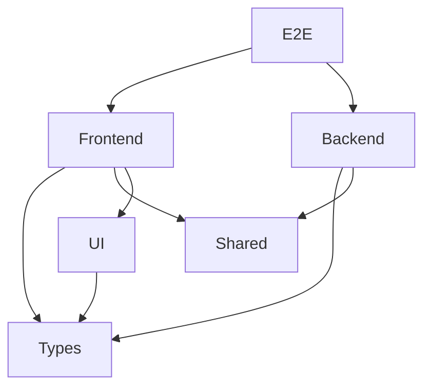
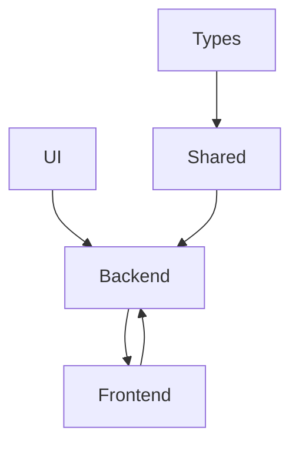

# Guía Completa para Crear un Monorepo Cliente-Servidor con PNPM

## Introducción

Este documento describe paso a paso cómo crear un monorepo utilizando PNPM para una aplicación Cliente-Servidor compuesta por:

* Backend (Node.js)
* Frontend (React)
* Paquetes compartidos
* Pruebas End-to-End

La arquitectura propuesta busca:

* Centralizar todo el código en un único repositorio.
* Compartir tipos y utilidades entre aplicaciones.
* Reducir duplicación de código.
* Facilitar mantenimiento y escalabilidad.
* Permitir pruebas integradas de todo el sistema.

---

# Arquitectura General

## Estructura Final

```text
root/
│
├── apps/
│   ├── backend/
│   └── frontend/
│
├── packages/
│   ├── shared/
│   ├── types/
│   └── ui/
│
├── tests/
│   └── e2e/
│
├── pnpm-workspace.yaml
└── package.json
```

---

# ¿Qué representa cada carpeta?

## apps

Contiene aplicaciones ejecutables.

```text
apps/
├── backend/
└── frontend/
```

Ejemplos:

* API REST
* Aplicación React
* Aplicación móvil
* Panel administrativo

Regla:

> Si puede ejecutarse independientemente, pertenece a apps.

---

## packages

Contiene módulos reutilizables.

```text
packages/
├── shared/
├── types/
└── ui/
```

Ejemplos:

* Tipos TypeScript
* Utilidades compartidas
* Componentes visuales

Regla:

> Si puede ser utilizado por múltiples aplicaciones, pertenece a packages.

---

## tests

Contiene pruebas globales.

```text
tests/
└── e2e/
```

Ejemplos:

* Playwright
* Cypress

Regla:

> Si prueba el sistema completo, pertenece a tests.

---

# Dependencias Permitidas



---

# Dependencias Prohibidas



---

# Requisitos Previos

Verificar instalación:

```bash
node -v
```

```bash
pnpm -v
```

Si PNPM no está instalado:

```bash
npm install -g pnpm
```

---

# Paso 1: Crear el Proyecto

Crear carpeta principal:

```bash
mkdir zoo-tech
cd zoo-tech
```

Inicializar proyecto raíz:

```bash
pnpm init
```

Modificar package.json:

```json
{
  "name": "zoo-tech",
  "private": true
}
```

¿Por qué private?

Porque el proyecto raíz no será publicado en npm.

---

# Paso 2: Crear PNPM Workspace

Crear archivo:

```text
pnpm-workspace.yaml
```

Contenido:

```yaml
packages:
  - "apps/*"
  - "packages/*"
  - "tests/*"
```

Este archivo indica a PNPM qué carpetas forman parte del monorepo.

---

# Paso 3: Crear Estructura Base

```bash
mkdir apps
mkdir packages
mkdir tests
```

---

# Paso 4: Crear Aplicaciones

## Backend

```bash
mkdir apps/backend
cd apps/backend
pnpm init
```

Ejemplo:

```json
{
  "name": "@app/backend",
  "version": "1.0.0"
}
```

Instalar dependencias:

```bash
pnpm add express
pnpm add -D typescript tsx @types/node @types/express
```

Crear estructura:

```text
backend/
├── src/
└── tests/
```

---

## Frontend

Volver a raíz:

```bash
cd ../..
```

Crear React + TypeScript:

```bash
pnpm create vite apps/frontend --template react-ts
```

Instalar dependencias:

```bash
pnpm install
```

Crear estructura:

```text
frontend/
├── src/
└── tests/
```

---

# Paso 5: Crear Packages

## Shared

```bash
mkdir packages/shared
cd packages/shared
pnpm init
```

Package:

```json
{
  "name": "@packages/shared",
  "version": "1.0.0"
}
```

Crear:

```text
shared/
└── src/
```

---

## Types

```bash
mkdir packages/types
cd packages/types
pnpm init
```

Package:

```json
{
  "name": "@packages/types",
  "version": "1.0.0"
}
```

Crear:

```text
types/
└── src/
```

---

## UI

```bash
mkdir packages/ui
cd packages/ui
pnpm init
```

Package:

```json
{
  "name": "@packages/ui",
  "version": "1.0.0"
}
```

Instalar React:

```bash
pnpm add react react-dom
pnpm add -D typescript @types/react @types/react-dom
```

Crear:

```text
ui/
└── src/
```

---

# Paso 6: Crear Tests E2E

```bash
mkdir tests/e2e
cd tests/e2e
pnpm init
```

Instalar Playwright:

```bash
pnpm add -D @playwright/test
```

Estructura:

```text
e2e/
└── tests/
```

---

# Paso 7: Conectar Packages

Instalar dependencia compartida.

Desde backend:

```bash
pnpm add @packages/shared --workspace --filter @app/backend
```

Instalar tipos:

```bash
pnpm add @packages/types --workspace --filter @app/backend
```

Frontend:

```bash
pnpm add @packages/shared --workspace --filter @app/frontend
```

```bash
pnpm add @packages/types --workspace --filter @app/frontend
```

```bash
pnpm add @packages/ui --workspace --filter @app/frontend
```

---

# Ejemplo Práctico

## Crear función compartida

packages/shared/src/math.ts

```ts
export function add(a:number,b:number){
    return a+b;
}
```

packages/shared/src/index.ts

```ts
export * from "./math";
```

---

## Consumir desde Backend

```ts
import { add } from "@packages/shared";

console.log(add(10,20));
```

Resultado:

```text
30
```

---

## Consumir desde Frontend

```tsx
import { add } from "@packages/shared";

function App() {

  return (
    <h1>{add(10,20)}</h1>
  );

}
```

Resultado:

```text
30
```

---

# Paso 8: Scripts Globales

Package.json raíz:

```json
{
  "private": true,
  "scripts": {
    "dev": "pnpm -r dev",
    "build": "pnpm -r build",
    "test": "pnpm -r test"
  }
}
```

---

# Comandos Importantes

## Instalar dependencias

```bash
pnpm install
```

---

## Ejecutar todos los proyectos

```bash
pnpm -r dev
```

---

## Ejecutar solo backend

```bash
pnpm --filter @app/backend dev
```

---

## Ejecutar solo frontend

```bash
pnpm --filter @app/frontend dev
```

---

## Construir todos los proyectos

```bash
pnpm -r build
```

---

## Ejecutar todas las pruebas

```bash
pnpm -r test
```

---

# Verificación del Monorepo

## Verificar Workspaces

```bash
pnpm list -r --depth 0
```

Salida esperada:

```text
@app/backend
@app/frontend
@packages/shared
@packages/types
@packages/ui
@tests/e2e
```

---

## Verificar Dependencias

```bash
pnpm why @packages/shared
```

Permite ver qué proyectos utilizan ese paquete.

---

## Verificar Enlaces Workspace

```bash
pnpm install
```

No deben aparecer errores como:

```text
ERR_PNPM_WORKSPACE_PKG_NOT_FOUND
```

---

## Verificar Imports Compartidos

Backend:

```ts
import { add } from "@packages/shared";
```

Frontend:

```tsx
import { add } from "@packages/shared";
```

Si TypeScript resuelve ambos imports correctamente, el workspace funciona.

---

# Buenas Prácticas

## Utilizar Types para Contratos

Correcto:

```ts
export interface AnimalDto {
  id:number;
  name:string;
}
```

Incorrecto:

```ts
export async function saveAnimal(){}
```

---

## Mantener Shared Independiente

Correcto:

```ts
export function formatDate(){}
```

Incorrecto:

```ts
import prisma from "...";
```

---

## Mantener UI Libre de Lógica de Negocio

Correcto:

```tsx
<Button />
```

Incorrecto:

```tsx
<ButtonThatCallsDatabase />
```

---

# Escalabilidad

Conforme el sistema crezca pueden añadirse nuevas aplicaciones:

```text
apps/
├── backend
├── frontend
├── admin
└── mobile
```

Y nuevos paquetes:

```text
packages/
├── shared
├── types
├── ui
└── config
```

Sin necesidad de modificar la arquitectura base.

---

# Conclusión

Esta arquitectura proporciona:

* Separación clara de responsabilidades.
* Reutilización de código.
* Contratos compartidos.
* Escalabilidad.
* Facilidad para realizar pruebas.
* Menor duplicación.
* Mantenimiento simplificado.

La regla principal para decidir dónde colocar algo es:

* ¿Se ejecuta por sí mismo? → apps
* ¿Se comparte entre aplicaciones? → packages
* ¿Existe únicamente para validar comportamiento? → tests

Si se respetan estas reglas, el monorepo puede crecer durante años manteniendo una estructura coherente y fácil de mantener.
