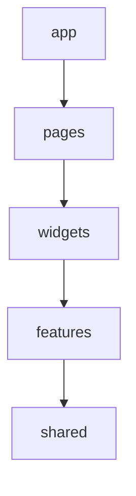

# `app/`

- [`app/`](#app)
  - [1. ¿Qué representa `app/`?](#1-qué-representa-app)
    - [1.1. Analogía](#11-analogía)
  - [2. Estructura General](#2-estructura-general)
  - [3. Flujo general](#3-flujo-general)
  - [4. ¿Por qué no poner todo en `App.tsx`?](#4-por-qué-no-poner-todo-en-apptsx)
  - [5. Estructura Interna](#5-estructura-interna)
    - [5.1. `app/App.tsx`](#51-appapptsx)
      - [5.1.1. Qué contiene](#511-qué-contiene)
      - [5.1.2. Lo ideal](#512-lo-ideal)
      - [5.1.3. Qué NO debería contener](#513-qué-no-debería-contener)
    - [5.2. `app/router/`](#52-approuter)
      - [5.2.1. ¿Qué significa?](#521-qué-significa)
      - [5.2.2. Responsabilidad](#522-responsabilidad)
      - [5.2.3. `AppRouter.tsx`](#523-approutertsx)
      - [5.2.4. `ProtectedRoute.tsx`](#524-protectedroutetsx)
    - [5.3. `app/store/`](#53-appstore)
      - [5.3.1. ¿Qué es?](#531-qué-es)
      - [5.3.2. Estado global](#532-estado-global)
      - [5.3.3. Si una feature tiene store propio, ¿por qué existe `app/store`?](#533-si-una-feature-tiene-store-propio-por-qué-existe-appstore)
      - [5.3.4. Regla práctica](#534-regla-práctica)
    - [5.4. `app/styles/`](#54-appstyles)
      - [5.4.1. ¿Qué contiene?](#541-qué-contiene)
      - [5.4.2. ¿Por qué no poner CSS aquí para toda la aplicación?](#542-por-qué-no-poner-css-aquí-para-toda-la-aplicación)
  - [6. Dependencias permitidas](#6-dependencias-permitidas)
    - [6.1. Qué NO debería existir en `app/`](#61-qué-no-debería-existir-en-app)
  - [7. Resumen mental](#7-resumen-mental)


---

## 1. ¿Qué representa `app/`?

Piensa en `app/` como el **contenedor raíz de la aplicación**.

Su responsabilidad NO es implementar funcionalidades de negocio.

No sabe de:

```text
Auth
Inventory
Billing
Reports
```

No contiene:

```text
LoginForm
ProductTable
InvoicePage
AnimalCard
```

Su única responsabilidad es:

> Inicializar, configurar y ensamblar la aplicación.

---

### 1.1. Analogía

Si tu frontend fuera un edificio:

```text
features/ = oficinas
shared/ = herramientas comunes
pages/ = habitaciones
widgets/ = áreas funcionales

app/ = infraestructura del edificio
```

---

## 2. Estructura General

```text
app/
│
├── router/
├── store/
├── styles/
└── App.tsx
```

---

## 3. Flujo general

```text
main.tsx
    │
    ▼
 App.tsx
    │
    ├── Router
    ├── Store
    ├── Providers
    ├── Theme
    └── Global Configuration
```

---

## 4. ¿Por qué no poner todo en `App.tsx`?

Muchos proyectos React comienzan así:

```tsx
function App() {

  // rutas

  // store

  // auth

  // providers

  // temas

  // notificaciones

  // etc

}
```

Después de unos meses:

```plaintext
App.tsx
1200 líneas
```

Se convierte en un "mini monolito frontend".

Por eso se extrae todo a carpetas especializadas.

---

## 5. Estructura Interna

### 5.1. `app/App.tsx`

Es el corazón de la aplicación.

Pero debe ser extremadamente pequeño.

---

#### 5.1.1. Qué contiene

Normalmente:

* Providers globales
* Router principal
* Configuración global

---

**Ejemplo**

```tsx
import { AppRouter } from "./router/AppRouter";

export function App() {
  return <AppRouter />;
}
```

---

#### 5.1.2. Lo ideal

Cuando abras `App.tsx` deberías ver algo parecido a:

```tsx
export function App() {
  return (
    <Providers>
      <AppRouter />
    </Providers>
  );
}
```

Nada más.

---

#### 5.1.3. Qué NO debería contener

- Fetch de APIs
- Login
- Formularios
- Lógica de inventario
- Componentes de negocio

---

### 5.2. `app/router/`

---

#### 5.2.1. ¿Qué significa?

Define la navegación global.

---

#### 5.2.2. Responsabilidad

Transformar:

```text
/dashboard
/inventory
/reports
/login
```

en:

```tsx
<DashboardPage />
<InventoryPage />
<ReportsPage />
<LoginPage />
```

---

**Ejemplo**

```text
router/
├── AppRouter.tsx
├── ProtectedRoute.tsx
└── routes.ts
```

---

#### 5.2.3. `AppRouter.tsx`

```tsx
import { Routes, Route } from "react-router-dom";

import { LoginPage } from "@/features/auth/pages/LoginPage";
import { DashboardPage } from "@/pages/DashboardPage";

export function AppRouter() {
  return (
    <Routes>

      <Route
        path="/login"
        element={<LoginPage />}
      />

      <Route
        path="/dashboard"
        element={<DashboardPage />}
      />

    </Routes>
  );
}
```

---

**¿Las páginas de una feature pueden estar dentro de features?**

Sí.

De hecho ya es así:

```text
features/
└── auth/
    └── pages/
```

Porque `Login` pertenece exclusivamente a `Auth`.

---

Pero:

```text
pages/
└── DashboardPage
```

Puede existir porque combina múltiples `features`.

---

#### 5.2.4. `ProtectedRoute.tsx`

Muy común. Sirve para proteger rutas.

---

```tsx
type Props = {
  children: React.ReactNode;
};

export function ProtectedRoute({
  children
}: Props) {

  const authenticated = true;

  if (!authenticated)
    return <Navigate to="/login" />;

  return children;
}
```

---

**¿Quién lo usa?**

```tsx
<Route
  path="/dashboard"
  element={
    <ProtectedRoute>
      <DashboardPage />
    </ProtectedRoute>
  }
/>
```

---

### 5.3. `app/store/`

Esta carpeta genera muchísimas dudas.

---

#### 5.3.1. ¿Qué es?

Estado global de la aplicación. no estado local

---

Ejemplo de estado local:

```tsx
const [open, setOpen] = useState(false);
```

Eso se queda dentro del componente.

---

#### 5.3.2. Estado global

Es información utilizada por muchas partes del sistema. Por ejemplo:

```text
Usuario autenticado
Tenant actual
Tema
Idioma
Permisos
```

---

**Ejemplo**

```text
store/
├── index.ts
├── auth.store.ts
└── tenant.store.ts
```

---

**auth.store.ts**

Con Zustand:

```tsx
import { create } from "zustand";

type AuthState = {
  user: string | null;
  login: (user: string) => void;
};

export const useAuthStore =
create<AuthState>((set) => ({

  user: null,

  login: (user) =>
    set({ user })

}));
```

---

**Uso**

```tsx
const user =
useAuthStore((s) => s.user);
```

---

#### 5.3.3. Si una feature tiene store propio, ¿por qué existe `app/store`?

Porque existen dos niveles de estado. 

- Estado global aplicación:

```text
auth
tenant
theme
language
```

- Estado de `feature`:

```text
inventory filters
billing wizard
report builder
```

Por eso es común tener:

```text
app/store/
features/inventory/store/
```

---

#### 5.3.4. Regla práctica

Pregunta:

> ¿Toda la aplicación necesita este dato?

Si la respuesta es sí, entonces va en:

```text
app/store
```

Si la respuesta es no, entonces va en:

```text
feature/store
```

---

### 5.4. `app/styles/`

---

#### 5.4.1. ¿Qué contiene?

Contiene estilos globales. No estilos de componentes.

**Ejemplo**

```text
styles/
├── globals.css
├── variables.css
├── reset.css
└── themes.css
```

---

**globals.css**

```css
body {
  margin: 0;
  font-family: sans-serif;
}
```

---

**variables.css**

```css
:root {

  --primary-color: #2563eb;

  --spacing-md: 16px;

}
```

---

**themes.css**

```css
[data-theme="dark"] {

  --background: black;

}
```

---

#### 5.4.2. ¿Por qué no poner CSS aquí para toda la aplicación?

Porque rompe la modularidad.

---

Dentro de `app/styles` está mal poner:

```css
.inventory-table {
}
```

Pero si está bien poner:

```text
features/inventory/components/
InventoryTable.module.css
```

---

## 6. Dependencias permitidas

Arquitectónicamente:



---

Pero `app` es especial, ya que puede ensamblar todo. Por ejemplo:

```tsx
App
 └── Router
      └── DashboardPage
           └── InventoryWidget
                └── InventoryFeature
                     └── SharedButton
```

---

### 6.1. Qué NO debería existir en `app/`

Cuando revises tu proyecto, si encuentras algo así:

```text
app/
├── inventory/
├── auth/
├── billing/
```

Es una señal de alarma.

Porque `app` NO contiene negocio:

---

## 7. Resumen mental

Piensa en `app/` como la carpeta de **bootstrapping e infraestructura frontend**.

| Carpeta                          | Responsabilidad          |
| -------------------------------- | ------------------------ |
| App.tsx                          | Punto de entrada React   |
| router/                          | Navegación global        |
| store/                           | Estado global compartido |
| styles/                          | Estilos globales         |
| providers/ (si luego la agregas) | Contextos globales       |

Regla de oro:

> Si el código sigue teniendo sentido aunque elimines completamente Auth, Inventory, Billing y Reports, probablemente pertenece a `app/`. Si depende de una funcionalidad de negocio, probablemente no pertenece a `app/`.