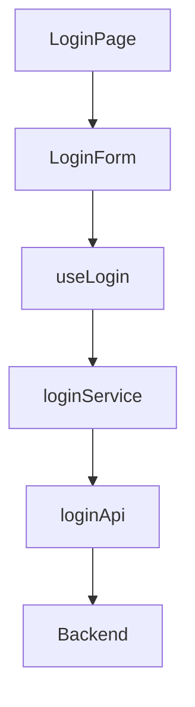
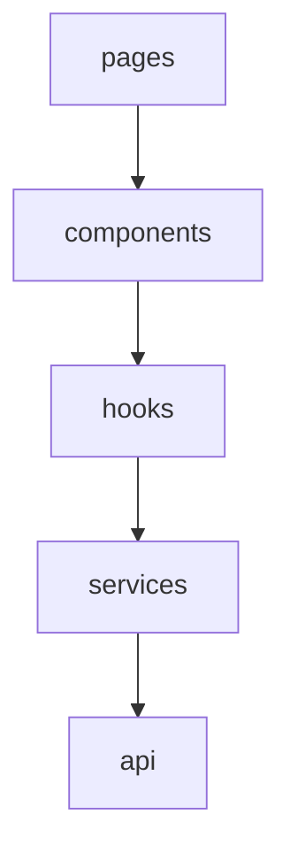
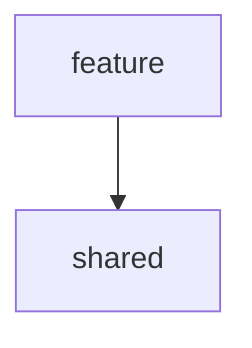

# `features/`

Si `app/` es la infraestructura y `shared/` son las herramientas comunes, entonces:

> `features/` es donde vive el negocio de la aplicación.

Aquí es donde realmente se implementan las funcionalidades que generan valor para el usuario.

- [`features/`](#features)
  - [1. ¿Qué es una `Feature`?](#1-qué-es-una-feature)
    - [1.1.  Error común](#11--error-común)
  - [2. Estructura General](#2-estructura-general)
  - [3. Anatomía completa de una `Feature`](#3-anatomía-completa-de-una-feature)
    - [3.1. `auth/api/`](#31-authapi)
      - [3.1.1. ¿Qué contiene?](#311-qué-contiene)
      - [3.1.2. Qué NO contiene](#312-qué-no-contiene)
      - [3.1.3. Regla](#313-regla)
    - [3.2. `auth/types/`](#32-authtypes)
      - [3.2.1. ¿Qué contiene?](#321-qué-contiene)
      - [3.2.2. Qué NO contiene](#322-qué-no-contiene)
    - [3.3. `auth/services/`](#33-authservices)
      - [3.3.1. ¿Qué contiene?](#331-qué-contiene)
      - [3.3.2. Regla mental](#332-regla-mental)
    - [3.4. `auth/store/`](#34-authstore)
      - [3.4.1. ¿Qué contiene?](#341-qué-contiene)
      - [3.4.2. Ejemplo con `Zustand`](#342-ejemplo-con-zustand)
      - [3.4.3. ¿Por qué existe `auth/store` si ya existe `app/store`?](#343-por-qué-existe-authstore-si-ya-existe-appstore)
      - [3.4.4. Regla](#344-regla)
    - [3.5. `auth/hooks/`](#35-authhooks)
      - [3.5.1. ¿Qué contiene?](#351-qué-contiene)
      - [3.5.2. ¿Por qué no ponerlo en `shared/hooks`?](#352-por-qué-no-ponerlo-en-sharedhooks)
    - [3.6. `auth/components/`](#36-authcomponents)
      - [3.6.1. ¿Qué contiene?](#361-qué-contiene)
      - [3.6.2. Qué NO contiene](#362-qué-no-contiene)
      - [3.6.3. ¿`LoginForm` usa `Button`?](#363-loginform-usa-button)
    - [3.7. `auth/pages/`](#37-authpages)
      - [3.7.1. ¿Qué contiene?](#371-qué-contiene)
      - [3.7.2. ¿Por qué existe `pages` dentro de una `feature`?](#372-por-qué-existe-pages-dentro-de-una-feature)
  - [4. Flujo completo](#4-flujo-completo)
    - [4.1. Login](#41-login)
  - [5. Ejemplo completo simplificado](#5-ejemplo-completo-simplificado)
  - [6. Dependencias permitidas](#6-dependencias-permitidas)
    - [6.1. ¿Puede una `feature` usar otra `feature`?](#61-puede-una-feature-usar-otra-feature)
  - [7. ¿Todas las features deben tener todas las carpetas?](#7-todas-las-features-deben-tener-todas-las-carpetas)
  - [8. Regla de oro de `Features`](#8-regla-de-oro-de-features)
  - [9. Resumen mental](#9-resumen-mental)


---

## 1. ¿Qué es una `Feature`?

Una Feature representa una capacidad del negocio.

Por ejemplo, para el ejemplo actual:

```text
auth
tenancy
animals
milk-production
inventory
billing
reports
```

Cada una responde a una pregunta de negocio:

```text
auth -> ¿Cómo se autentican los usuarios?

tenancy -> ¿Cómo se gestionan los tenants?

animals -> ¿Cómo se administran los animales?

inventory -> ¿Cómo se gestiona el inventario?

billing -> ¿Cómo se facturan los servicios?
```

---

### 1.1.  Error común

Muchos desarrolladores organizan por tipo técnico:

```text
components/
pages/
hooks/
services/
```

y luego mezclan:

```text
LoginForm
InvoiceTable
AnimalCard
ReportChart
```

Todos en la misma carpeta.

---

Con `Features` hacemos lo contrario:

```text
auth/
inventory/
billing/
```

Todo lo relacionado con una funcionalidad queda agrupado.

---

## 2. Estructura General

```text
features/
│
├── auth/
├── tenancy/
├── animals/
├── milk-production/
├── inventory/
├── billing/
└── reports/
```

Cada módulo es prácticamente un "mini frontend".

---

Piensa en una `feature` como un pequeño proyecto independiente. Por ejemplo un `features/auth` podría contener:

```text
UI
Hooks
Tipos
Store
Servicios
API
Páginas
```

Sin tener que depender de otras `features`.

---

## 3. Anatomía completa de una `Feature`

Tomemos `Auth` como ejemplo.

```text
auth/
│
├── api/
├── components/
├── hooks/
├── pages/
├── services/
├── store/
└── types/
```

---

### 3.1. `auth/api/`

---

#### 3.1.1. ¿Qué contiene?

Comunicación con backend. Su única responsabilidad es hablar con la API, contiene:

```text
loginApi.ts
logoutApi.ts
refreshTokenApi.ts
```

---

**Ejemplo**

```ts
import { api } from "@/shared/services/api";

export async function loginRequest(
  email: string,
  password: string
) {
  const response = await api.post(
    "/auth/login",
    {
      email,
      password
    }
  );

  return response.data;
}
```

---

#### 3.1.2. Qué NO contiene

No contiene lógica de negocio, por ejemplo esto sería incorrecto:

```ts
export async function login() {

  const response = ...

  if(response.role === "ADMIN") {
     ...
  }

}
```

Esto pertenece a `services`.

---

#### 3.1.3. Regla

```text
api/ -> solo HTTP
```

---

### 3.2. `auth/types/`

---

#### 3.2.1. ¿Qué contiene?

Modelos y contratos usados únicamente por la `feature`. Por ejemplo:

```ts
export type User = {

  id: string;

  name: string;

  email: string;

};
```

---

```ts
export type LoginRequest = {

  email: string;

  password: string;

};
```

---

```ts
export type LoginResponse = {

  token: string;

  user: User;

};
```

---

#### 3.2.2. Qué NO contiene

No contiene tipos globales. Por ejemplo esto sería incorrecto:

```ts
ApiResponse
Pagination
```

Debido a que esto pertenece a `shared/types`

---

### 3.3. `auth/services/`

---

#### 3.3.1. ¿Qué contiene?

Lógica de negocio frontend. Sería algo así:

```text
api = infraestructura
service = negocio
```

---

**Ejemplo**

```ts
import { loginRequest } from "../api/loginApi";

export async function login(
  email: string,
  password: string
) {

  const result =
    await loginRequest(
      email,
      password
    );

  localStorage.setItem(
    "token",
    result.token
  );

  return result;

}
```

Aquí `Service` usa `API`, no al revés.

---

#### 3.3.2. Regla mental

`API` responde, ¿Cómo llamo al backend?. `Service` responde, ¿Qué hago con el resultado?.

---

### 3.4. `auth/store/`

---

#### 3.4.1. ¿Qué contiene?

Estado compartido pero solo de la `feature`. Por ejemplo:

```text
usuario actual
token
roles
permisos
```

---

#### 3.4.2. Ejemplo con `Zustand`

```ts
import { create } from "zustand";

type AuthStore = {

  user: User | null;

  setUser:
    (user: User | null) => void;

};

export const useAuthStore =
create<AuthStore>((set) => ({

  user: null,

  setUser: (user) =>
    set({ user })

}));
```

---

#### 3.4.3. ¿Por qué existe `auth/store` si ya existe `app/store`?

Porque son niveles distintos. `app/store` almacena información global (theme, language, tenant, etc.), mientras que `auth/store` almacena información específica de la `feature` `Auth` (user, permissions, token, etc.).

---

#### 3.4.4. Regla

Si una `feature` desaparece mañana, `auth/store` desaparece con ella

---

### 3.5. `auth/hooks/`

---

#### 3.5.1. ¿Qué contiene?

Hooks específicos de `Auth`. Por ejemplo:

```text
useLogin
useLogout
useCurrentUser
usePermissions
```

---

**Ejemplo**

```ts
import { login } from "../services/loginService";

export function useLogin() {

  async function execute(
    email: string,
    password: string
  ) {

    return login(
      email,
      password
    );

  }

  return {
    execute
  };

}
```

---

#### 3.5.2. ¿Por qué no ponerlo en `shared/hooks`?

Porque depende de `Auth`. `shared/hooks` debe ser reutilizable por cualquier `feature` no únicamente por una sola.

---

### 3.6. `auth/components/`

---

#### 3.6.1. ¿Qué contiene?

Componentes de UI específicos de `Auth` como:

```text
LoginForm
RegisterForm
ForgotPasswordForm
UserMenu
```

---

**Ejemplo**

```tsx
import { useState } from "react";

export function LoginForm() {

  const [email, setEmail] =
    useState("");

  return (

    <form>

      <input
        value={email}
        onChange={(e) =>
          setEmail(e.target.value)}
      />

    </form>

  );

}
```

---

#### 3.6.2. Qué NO contiene

Componentes reutilizables por cualquier `feature`. Esto sería incorrecto:

```text
Button
Modal
Input
```

Esto pertenece a `shared/components`:

---

#### 3.6.3. ¿`LoginForm` usa `Button`?

Sí, y es exactamente lo esperado.

```text
LoginForm -> shared/Button
```

---

### 3.7. `auth/pages/`

---

#### 3.7.1. ¿Qué contiene?

Páginas propias de `Auth`. Por ejemplo:

```text
LoginPage
RegisterPage
ForgotPasswordPage
```

---

**Ejemplo**

```tsx
import { LoginForm }
from "../components/LoginForm";

export function LoginPage() {

  return (
    <LoginForm />
  );

}
```

---

#### 3.7.2. ¿Por qué existe `pages` dentro de una `feature`?

Porque algunas páginas pertenecen exclusivamente a esa `feature`. Por ejemplo `/login`, que solo existe para `Auth`, no tiene sentido ponerla en `src/pages`.

---

## 4. Flujo completo

Ahora veamos cómo interactúan.

---

### 4.1. Login



---

Visualmente:



---

## 5. Ejemplo completo simplificado

**LoginPage**

```tsx
export function LoginPage() {
  return <LoginForm />;
}
```

---

**LoginForm**

```tsx
const { execute } = useLogin();

<Button
  onClick={() =>
    execute(
      email,
      password
    )
  }
>
  Login
</Button>
```

---

**useLogin**

```ts
export function useLogin() {

  return {

    execute: login

  };

}
```

---

**loginService**

```ts
export async function login(
  email: string,
  password: string
) {

  return loginRequest(
    email,
    password
  );

}
```

---

**loginApi**

```ts
export async function loginRequest(
  email: string,
  password: string
) {

  return api.post(
    "/auth/login",
    {
      email,
      password
    }
  );

}
```

---

## 6. Dependencias permitidas

Dentro de una `feature`:


---

Y además:



---

### 6.1. ¿Puede una `feature` usar otra `feature`?

No directamente. Evita esto: `inventory` importa `billing`, debido a que se empiezan a crear dependencias cruzadas cuando ambas llegan a necesitar algo común de `shared`, `widgets` o `pages`:

---

## 7. ¿Todas las features deben tener todas las carpetas?

No, por ejemplo para `reports` la siguiente estructura podría ser suficiente:

```text
reports/
├── api/
├── components/
└── pages/
```

La estructura debe crecer cuando aparezca la necesidad. No antes.

---

## 8. Regla de oro de `Features`

Una feature debe poder responder esta pregunta:

> "Si mañana moviera toda esta carpeta a otro proyecto, ¿seguiría teniendo sentido por sí sola?"

Si la respuesta es sí, significa que está bien encapsulada.

---

## 9. Resumen mental

| Carpeta    | Responsabilidad                   |
| ---------- | --------------------------------- |
| api        | comunicación HTTP                 |
| types      | contratos y modelos de la feature |
| services   | lógica de negocio frontend        |
| store      | estado compartido de la feature   |
| hooks      | lógica React de la feature        |
| components | UI específica de la feature       |
| pages      | rutas propias de la feature       |