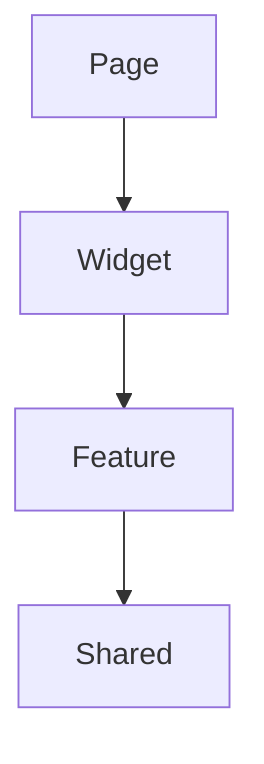
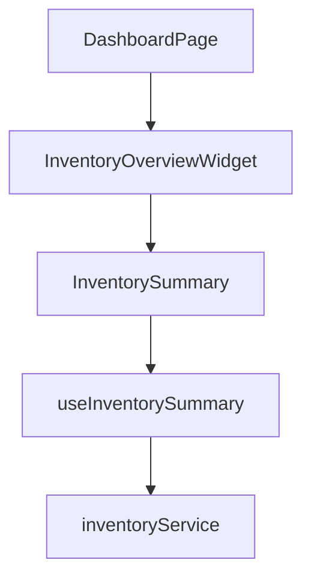

# `pages/`

```text
src/
└── pages/
```

Después de haber visto:

```text
features/*/pages
widgets/
```

la pregunta natural es:

> ¿Para qué necesito `src/pages` si ya tengo páginas dentro de las features?

La respuesta es:

> Porque existen páginas que pertenecen a la aplicación completa y no a una única feature.

---

## 1. El propósito de `pages/`

La carpeta `src/pages/` contiene las páginas de más alto nivel de la aplicación. Estas son páginas que normalmente:

* Coordinan varias `features`.
* Utilizan `widgets`.
* Representan módulos completos del sistema.
* Funcionan como "orquestadores".

---

## 2. Diferencia entre `Feature Page` y `App Page`

### 2.1. Feature Page

Pertenece completamente a una `feature` como `/login`, `/register` o `/forgot-password`, dentro de `features/auth/pages`, o `/animals/create` dentro de `features/animals/pages`. La página existe porque existe la `feature`.

---

### 2.2. App Page

Pertenece a toda la aplicación como `/dashboard`, `/admin`, `/tenant-home` o `/executive-overview`, ya que estas páginas suelen combinar:

```text
auth
inventory
billing
reports
animals
milk-production
```

Por eso viven en `src/pages`:

---

## 3. Error muy común

Mucha gente mete todo aquí:

```text
pages/

LoginPage
RegisterPage

AnimalPage
AnimalDetailsPage

InventoryPage
InventoryEditPage

ReportPage
ReportDetailsPage
```

---

Después de 2 años:

```text
pages/
│
├── LoginPage
├── RegisterPage
├── AnimalPage
├── AnimalEditPage
├── AnimalDetailsPage
├── AnimalHistoryPage
├── InventoryPage
├── InventoryEditPage
├── InventoryHistoryPage
├── ...
```

200 archivos mezclados.

Esto es precisamente lo que Feature-Based Architecture intenta evitar.

---

## 4. ¿Qué debería ir aquí?

Pocas páginas, muy pocas. Por ejemplo para una SaaS

```text
pages/

DashboardPage
AdminPage
TenantHomePage
AnalyticsOverviewPage
```

---

No iría:

```text
LoginPage
```

Ya que es `Auth`.

---

Tampoco iría:

```text
AnimalPage
```

Porque es `Animals`.

---

Menos:

```text
InvoicePage
```

Porque es `Billing`.

---

## 5. Ejemplo práctico

Supongamos la ruta `/dashboard`, esta pantalla muestra:

- Producción de leche
- Inventario
- Facturación
- Animales
- Alertas

Claramente, está usando varias `features`, por lo tanto:

```text
pages/
└── DashboardPage.tsx
```

---

**DashboardPage**

```tsx
import { DashboardStatsWidget }
from "@/widgets/dashboard-stats";

import { RecentAnimalsWidget }
from "@/widgets/recent-animals";

import { InventoryOverviewWidget }
from "@/widgets/inventory-overview";

export function DashboardPage() {

  return (

    <>
      <DashboardStatsWidget />

      <RecentAnimalsWidget />

      <InventoryOverviewWidget />
    </>

  );

}
```

---

Observa algo importante. La página no sabe:

- Cómo se consulta la API
- Cómo se obtiene el inventario
- Cómo se calculan indicadores

La página únicamente ensambla.

---

## 6. Relación con Widgets

Normalmente:



---

**Ejemplo**



La página no llega hasta abajo.

---

## 7. Ejemplo real

Imagina la pantalla `Farm Dashboard` que muestra:

- Animales registrados
- Producción diaria
- Inventario disponible
- Facturas pendientes

Arquitectura:

```text
pages/
└── FarmDashboardPage

widgets/
├── AnimalsSummaryWidget
├── ProductionSummaryWidget
├── InventorySummaryWidget
└── BillingSummaryWidget

features/
├── animals
├── milk-production
├── inventory
└── billing
```

---

**Visualmente**:

```mermaid
graph TD;
    FarmDashboardPage --> Animals Widget
    FarmDashboardPage --> Production Widget
    FarmDashboardPage --> Inventory Widget
    FarmDashboardPage --> Billing Widget
```

---

## 8. Preguntas comunes

### 8.1. ¿Una `Page` puede usar directamente una `Feature`?

Sí puede. Por ejemplo:

```tsx
import { LoginForm }
from "@/features/auth/components/LoginForm";

export function LoginPage() {

  return <LoginForm />;

}
```

Esto es perfectamente válido.

---

### 8.2. ¿Una `Page` puede usar `Shared`?

Sí puede.


```tsx
import { Button }
from "@/shared/components/Button";
```

---

Pero normalmente se respeta este flujo:


Porque es más limpio.

---

### 8.3. ¿Puedo eliminar `pages` y usar solo `feature/pages`?

Sí puedes, muchos proyectos lo hacen, por ejemplo:

```text
features/

auth/pages
animals/pages
inventory/pages
reports/pages
```
Y el router apunta directamente a ellas. Funciona perfectamente.

Pero cuando aparecen páginas que combinan múltiples módulos:

```text
Dashboard
Admin
Analytics
Tenant Home
```

Empieza a tener sentido una carpeta `src/pages`:

---

### 8.4. ¿`Pages` es lo mismo que `Layout`?

No es lo mismo.

**Layout**

Define estructura visual, por ejemplo:

```tsx
<DashboardLayout>

  <DashboardPage />

</DashboardLayout>
```

---

El `Layout` contiene:

- Sidebar
- Header
- Footer
- Breadcrumb

---

**Page**

Contiene:

- Widgets
- Features
- Contenido principal

---

## 9. Una Mejora Futura

Cuando tengas una aplicación compleja tipo SaaS, probablemente se agregará:

```text
src/
├── layouts/
│
├── pages/
│
├── widgets/
│
├── features/
│
└── shared/
```

Ejemplo en `layouts/`:

```text
layouts/

DashboardLayout
AuthLayout
AdminLayout
```

Entonces:

```tsx
<DashboardLayout>

   <DashboardPage />

</DashboardLayout>
```

---

## 10. Regla práctica para decidir

Pregúntate:

> ¿Esta página deja de tener sentido si elimino una feature específica?

Si la respuesta es sí, entonces va en `features/<feature>/pages`, por ejemplo:

- LoginPage
- RegisterPage
- AnimalEditPage

Si la respuesta es no porque coordina varias `features`, entonces va en `src/pages`, por ejemplo:

- DashboardPage
- AdminPage
- TenantHomePage

---

## 11. Resumen mental

| Carpeta  | Responsabilidad                      |
| -------- | ------------------------------------ |
| shared   | herramientas reutilizables           |
| features | capacidades de negocio               |
| widgets  | secciones funcionales de UI          |
| pages    | pantallas completas de la aplicación |

Jerarquía típica:

