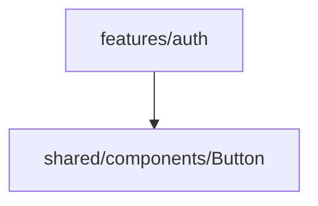
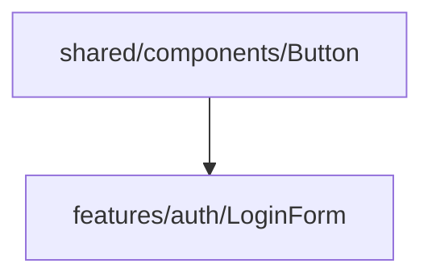
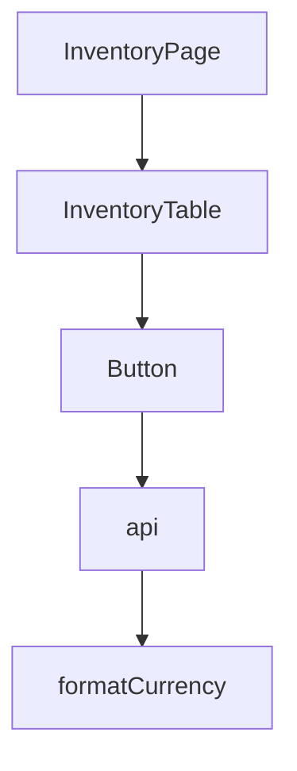
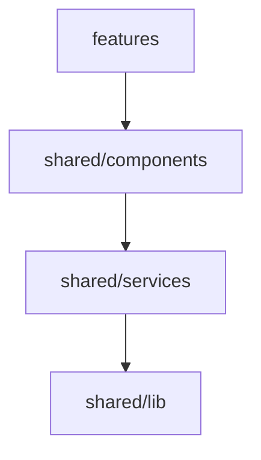

# `shared/`

Si `app/` es la infraestructura de la aplicación, entonces:

> `shared/` es la caja de herramientas común que cualquier parte del sistema puede utilizar.

- [`shared/`](#shared)
  - [1. ¿Qué representa `shared`?](#1-qué-representa-shared)
    - [1.1. Dependencia correcta](#11-dependencia-correcta)
    - [1.2. Dependencia incorrecta](#12-dependencia-incorrecta)
    - [1.3. Pregunta fundamental](#13-pregunta-fundamental)
  - [2. Estructura General](#2-estructura-general)
  - [3. Estructura Interna](#3-estructura-interna)
    - [3.1. `shared/assets/`](#31-sharedassets)
      - [3.1.1. ¿Qué contiene?](#311-qué-contiene)
      - [3.1.2. Uso](#312-uso)
      - [3.1.3. Qué NO debería contener](#313-qué-no-debería-contener)
      - [3.1.4. ¿Todo `asset` va en `shared`?](#314-todo-asset-va-en-shared)
    - [3.2. `shared/components/`](#32-sharedcomponents)
      - [3.2.1. ¿Qué contiene?](#321-qué-contiene)
      - [3.2.2. Ejemplo `Button.tsx`](#322-ejemplo-buttontsx)
      - [3.2.3. ¿`UserCard` debería estar aquí?](#323-usercard-debería-estar-aquí)
      - [3.2.4. Regla práctica](#324-regla-práctica)
    - [3.3. `shared/hooks/`](#33-sharedhooks)
      - [3.3.1. ¿Qué contiene?](#331-qué-contiene)
      - [3.3.2. ¿Qué NO contiene?](#332-qué-no-contiene)
    - [3.4. `shared/lib/`](#34-sharedlib)
      - [3.4.1. ¿Qué significa?](#341-qué-significa)
      - [3.4.2. ¿Cuál es la diferencia entre `hooks` y `lib`?](#342-cuál-es-la-diferencia-entre-hooks-y-lib)
    - [3.5. `shared/services/`](#35-sharedservices)
      - [3.5.1. ¿Qué contiene?](#351-qué-contiene)
      - [3.5.2. ¿Puedo poner `AuthService` aquí?](#352-puedo-poner-authservice-aquí)
      - [3.5.3. Regla](#353-regla)
    - [3.6. `shared/styles/`](#36-sharedstyles)
      - [3.6.1. ¿Qué contiene?](#361-qué-contiene)
      - [3.6.2. ¿Qué NO contiene?](#362-qué-no-contiene)
    - [3.7. `shared/types/`](#37-sharedtypes)
      - [3.7.1. ¿Qué contiene?](#371-qué-contiene)
      - [3.7.2 ¿Qué NO contiene?](#372-qué-no-contiene)
  - [4. Interacción entre carpetas](#4-interacción-entre-carpetas)
  - [5. Ejemplo completo](#5-ejemplo-completo)
    - [5.1. `shared/components/Button.tsx`](#51-sharedcomponentsbuttontsx)
    - [5.2. `shared/lib/formatCurrency.ts`](#52-sharedlibformatcurrencyts)
    - [5.3. `features/inventory/components/ProductCard.tsx`](#53-featuresinventorycomponentsproductcardtsx)
  - [6. Regla de oro de `shared`](#6-regla-de-oro-de-shared)
  - [7. Resumen mental rápido](#7-resumen-mental-rápido)


---

## 1. ¿Qué representa `shared`?

La regla mental más importante es:

> Todo lo que está en `shared/` puede ser utilizado por cualquier feature.

y además:

> Nada dentro de `shared/` debe depender de una feature.

---

### 1.1. Dependencia correcta



---

### 1.2. Dependencia incorrecta



Esto rompe completamente la arquitectura.

---

### 1.3. Pregunta fundamental

Cuando tengas una duda sobre dónde colocar algo, pregúntate:

> ¿Esto pertenece a una funcionalidad específica del negocio?

Si la respuesta es si, entonces va en `features/`.

Si la respuesta es no, entonces puede ser reutilizado por cualquier módulo y va en `shared/`.

---

## 2. Estructura General

```text
shared/
│
├── assets/
├── components/
├── hooks/
├── lib/
├── services/
├── styles/
└── types/
```

---

## 3. Estructura Interna

### 3.1. `shared/assets/`

#### 3.1.1. ¿Qué contiene?

Recursos estáticos compartidos. Como:

```text
logos
íconos
imágenes
fuentes
svg
```

---

**Ejemplo**

```text
shared/assets/

├── logo.svg
├── favicon.ico
├── empty-state.png
└── fonts/
```

---

#### 3.1.2. Uso

```tsx
import Logo from "@/shared/assets/logo.svg";

export function Header() {
  return ;
}
```

---

#### 3.1.3. Qué NO debería contener

Imágenes exclusivas de una `feature`.

Ejemplo:

```text
inventory-chart-background.png
```

Si solo lo usa `Inventory` entonces debe ir en una carpeta `features/inventory/assets/` dentro de la `feature`:

---

#### 3.1.4. ¿Todo `asset` va en `shared`?

No. Solamente los reutilizables.

---

### 3.2. `shared/components/`

Esta suele ser la carpeta más utilizada.

---

#### 3.2.1. ¿Qué contiene?

Componentes UI reutilizables. Como:

```text
Button
Input
Card
Modal
Table
Spinner
Badge
Tooltip
```

No contiene lógica de negocio.

**Incorrecto**

```tsx
InventoryTable
AnimalDetailsCard
```

Ya que pertenece solo a `Inventory`, y porque pertenece únicamente a `Animals`.


**Correcto**

```tsx
Card
```

Porque puede ser usado por cualquier `feature`.

---

#### 3.2.2. Ejemplo `Button.tsx`

```tsx
type Props = {
  children: React.ReactNode;
  onClick?: () => void;
};

export function Button({
  children,
  onClick
}: Props) {
  return (
    <button onClick={onClick}>
      {children}
    </button>
  );
}
```

---

**Uso**

En `Auth`:

```tsx
<Button>
  Login
</Button>
```

En `Inventory`:

```tsx
<Button>
  Save Product
</Button>
```

En `Billing`:

```tsx
<Button>
  Pay Invoice
</Button>
```

---

#### 3.2.3. ¿`UserCard` debería estar aquí?

Depende. Por ejemplo si es un `UserCard` 
con propiedades genéricas podria estar en `shared/components`, pero normalmente:

```tsx
TenantCard
AnimalCard
InvoiceCard
```

Pertenecen a una `feature`.

---

#### 3.2.4. Regla práctica

Si el nombre contiene términos del negocio:

```text
Animal
Inventory
Invoice
MilkProduction
Tenant
```

Normalmente, NO va en `shared`.

---

### 3.3. `shared/hooks/`

---

#### 3.3.1. ¿Qué contiene?

Hooks reutilizables. Un `Hook` es lógica reutilizable, nada de `UI`.

---

**Por ejemplo**

```tsx
const [data, setData] = useState(...)
```

Esto NO es un `hook` compartido. Un `Hook` compartido es algo como:

```tsx
useDebounce
useLocalStorage
useWindowSize
usePagination
useTheme
```

---

**useLocalStorage**

```tsx
import { useState } from "react";

export function useLocalStorage(
  key: string,
  initialValue: string
) {

  const [value, setValue] =
    useState(
      localStorage.getItem(key)
      ?? initialValue
    );

  return [value, setValue];
}
```

---

**Uso**

```tsx
const [theme, setTheme] =
useLocalStorage(
  "theme",
  "light"
);
```

---

#### 3.3.2. ¿Qué NO contiene?

```tsx
useLogin()
```

Porque es de `Auth`.

---

```tsx
useInventoryFilters()
```

Porque es `Inventory`.

---

Esos pertenecen a:

```text
features/auth/hooks
features/inventory/hooks
```

---

### 3.4. `shared/lib/`

Esta carpeta genera muchas dudas.

---

#### 3.4.1. ¿Qué significa?

Significa `Library` y contiene funciones puras reutilizables que no dependen de React, como:

```tsx
formatCurrency()
```

---

```tsx
calculateAge()
```

---

```tsx
formatDate()
```

---

**Ejemplo**

```ts
export function formatCurrency(
  value: number
) {

  return new Intl.NumberFormat(
    "es-PE",
    {
      style: "currency",
      currency: "PEN"
    }
  ).format(value);

}
```

---

**Uso**

```tsx
formatCurrency(1250)
```

**Resultado**:

```text
S/ 1,250.00
```

---

#### 3.4.2. ¿Cuál es la diferencia entre `hooks` y `lib`?

`Hook`:

```tsx
useWindowSize()
```

Usa React.

---

`Lib`:

```ts
formatDate()
```

No usa React.

---

Regla rápida, pregunta ¿Usa React?. Si la respuesta es si entonces va en `hooks` si no entonces va en `lib`.

---

### 3.5. `shared/services/`

Esta carpeta suele usarse mal.

---

#### 3.5.1. ¿Qué contiene?

Servicios técnicos compartidos, nada de servicios de negocio. Por ejemplo:

```text
Axios
Fetch Client
Storage Service
Logger
EventBus
Auth Token Manager
```

---

**api.ts**

```ts
import axios from "axios";

export const api =
axios.create({

  baseURL:
    import.meta.env.VITE_API_URL

});
```

---

**Uso**

En `Inventory`:

```tsx
api.get("/inventory")
```

En `Auth`:

```tsx
api.post("/login")
```

En `Billing`:

```tsx
api.get("/invoices")
```

---

#### 3.5.2. ¿Puedo poner `AuthService` aquí?

Generalmente NO. Está mal tenerlo en `shared/services/AuthService` Porque `Auth` es negocio, es mejor tenerlo en features/auth/services/AuthService:

---

#### 3.5.3. Regla

`shared/services` contiene infraestructura técnica.

No casos de negocio.

---

### 3.6. `shared/styles/`

---

#### 3.6.1. ¿Qué contiene?

Estilos reutilizables como:

```text
variables.css
colors.css
themes.css
typography.css
```

---

**variables.css**

```css
:root {

  --primary-color: #2563eb;

  --border-radius: 8px;

}
```

---

**Uso**

```css
.button {

  border-radius:
    var(--border-radius);

}
```

---

#### 3.6.2. ¿Qué NO contiene?

```css
.inventory-table
```

---

```css
.animal-form
```

---

Eso pertenece a la `feature`.

---

### 3.7. `shared/types/`

Muy importante en TypeScript.

---

#### 3.7.1. ¿Qué contiene?

Tipos reutilizables globalmente como:

```text
ApiResponse
Pagination
SelectOption
BaseEntity
```

---

**ApiResponse**

```ts
export type ApiResponse<T> = {

  data: T;

  success: boolean;

  message?: string;

};
```

---

**Uso**

En `Auth`:

```ts
ApiResponse<User>
```

En `Inventory`:

```ts
ApiResponse<Product>
```

En `Billing`:

```ts
ApiResponse<Invoice>
```

---

#### 3.7.2 ¿Qué NO contiene?

```ts
Animal
Invoice
Tenant
MilkProduction
```

Porque pertenecen al dominio.

---

## 4. Interacción entre carpetas

Supongamos este flujo:



---

Arquitectónicamente:



---

## 5. Ejemplo completo

### 5.1. `shared/components/Button.tsx`

```tsx
export function Button(
  props: React.ButtonHTMLAttributes<HTMLButtonElement>
) {
  return <button {...props} />;
}
```

---

### 5.2. `shared/lib/formatCurrency.ts`

```ts
export function formatCurrency(
  value: number
) {

  return new Intl.NumberFormat(
    "es-PE",
    {
      style: "currency",
      currency: "PEN"
    }
  ).format(value);

}
```

---

### 5.3. `features/inventory/components/ProductCard.tsx`

```tsx
import { Button }
from "@/shared/components/Button";

import { formatCurrency }
from "@/shared/lib/formatCurrency";

export function ProductCard() {

  const price = 250;

  return (

    <div>

      <p>
        {formatCurrency(price)}
      </p>

      <Button>
        Comprar
      </Button>

    </div>

  );

}
```

---

## 6. Regla de oro de `shared`

Todo lo que está en `shared/` debe responder afirmativamente a esta pregunta:

> "¿Podría ser utilizado mañana por Auth, Inventory, Billing, Reports o cualquier feature nueva sin modificarlo?"

Si la respuesta es sí, probablemente pertenece a `shared`.

Si la respuesta es no y depende del negocio, probablemente pertenece a `features`.

---

## 7. Resumen mental rápido

| Carpeta    | Contiene                              |
| ---------- | ------------------------------------- |
| assets     | imágenes, fuentes, iconos compartidos |
| components | UI reutilizable                       |
| hooks      | lógica React reutilizable             |
| lib        | funciones puras reutilizables         |
| services   | infraestructura técnica compartida    |
| styles     | estilos globales reutilizables        |
| types      | tipos TypeScript globales             |
