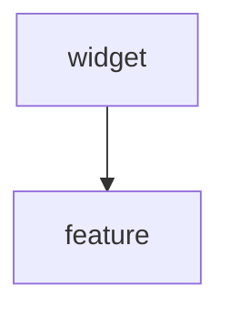
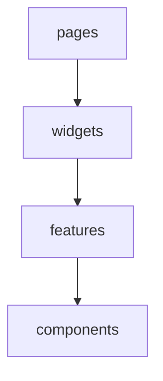
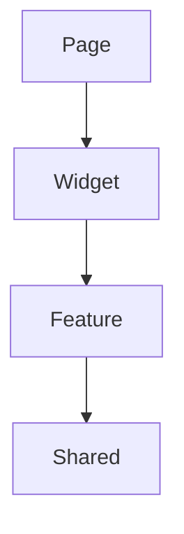

Perfecto. Ahora llegamos a una de las carpetas más interesantes y, al mismo tiempo, más confusas de las arquitecturas frontend modernas:

# widgets/

Esta carpeta suele generar preguntas como:

> "Si ya tengo `components/` y `pages/`, ¿para qué necesito `widgets/`?"

> "¿No podría poner esto directamente en una página?"

La respuesta corta es:

> Sí, podrías. Pero cuando la aplicación crece, `widgets/` ayuda a mantener la composición de la UI organizada.

---

## 1. ¿Qué es un Widget?

Un widget es un bloque funcional grande de interfaz que:

* Combina múltiples componentes.
* Puede combinar múltiples `features`.
* Tiene una responsabilidad visual clara.
* Puede reutilizarse en distintas páginas.

Piensa en él como una pieza de una pantalla.

---

## 2. Comparación rápida

**Component**

```text
Button
Input
Modal
Card
```

Son piezas pequeñas.

---

**Feature Component**

```text
LoginForm
AnimalForm
InventoryTable
InvoiceCard
```

Pertenecen a una `feature`.

---

**Widget**

```text
DashboardStatsWidget
InventoryOverviewWidget
RecentAnimalsWidget
BillingSummaryWidget
```

Son bloques completos de UI.

---

## 3. Analogía

Imagina una página Dashboard.

**Componentes**

```text
Button
Card
Badge
Chart
```

**Features**

```text
Inventory
Animals
Billing
Reports
```

**Widgets**

```text
Dashboard KPIs
Recent Animals
Monthly Revenue
Low Stock Alert
```

**Página**

```text
DashboardPage
```

`Page` ensambla todos esos widgets.

---

## 4. Ejemplo visual

Supongamos que tu Dashboard se ve así:

```text
+---------------------------+
| KPI Revenue               |
+---------------------------+

+---------------------------+
| KPI Animals               |
+---------------------------+

+---------------------------+
| Inventory Alerts          |
+---------------------------+

+---------------------------+
| Recent Milk Production    |
+---------------------------+
```

Cada bloque podría ser un widget.

---

## 5. Estructura General Típica

```text
widgets/
│
├── dashboard-stats/
│   ├── DashboardStatsWidget.tsx
│   └── index.ts
│
├── inventory-overview/
│   ├── InventoryOverviewWidget.tsx
│   └── index.ts
│
└── recent-animals/
    ├── RecentAnimalsWidget.tsx
    └── index.ts
```

---

### 5.1. ¿Por qué no poner esto en `pages`?

Muchos proyectos comienzan así:

```tsx
export function DashboardPage() {

  return (
    <>
      <RevenueCard />
      <AnimalsCard />
      <InventoryAlert />
      <ProductionChart />
      <ReportsSummary />
      <Notifications />
    </>
  );

}
```

Al principio parece bien. Pero después de algunos meses:

```tsx
DashboardPage.tsx
1200 líneas
```

con:

```text
fetch
layouts
grids
cards
charts
tabs
filters
modals
```

Todo mezclado.

---

Aquí aparece el concepto de Widget. Así debería verse una página:

```tsx
export function DashboardPage() {

  return (

    <>
      <DashboardStatsWidget />

      <InventoryOverviewWidget />

      <RecentAnimalsWidget />

      <ProductionSummaryWidget />
    </>

  );

}
```

La página se convierte en un ensamblador.

---

**Ejemplo real**

Supongamos un SaaS ganadero.

---

**Widget**

**RecentAnimalsWidget**

```tsx
import { AnimalTable }
from "@/features/animals/components/AnimalTable";

export function RecentAnimalsWidget() {

  return (

    <section>

      <h2>
        Animales recientes
      </h2>

      <AnimalTable />

    </section>

  );

}
```

Aquí:



---

### 5.2. ¿Puede un `Widget` usar varias `Features`?

Sí, y ahí es donde realmente aporta valor.

---

**Ejemplo**

**FarmOverviewWidget**

```tsx
import { AnimalSummary }
from "@/features/animals/components/AnimalSummary";

import { InventorySummary }
from "@/features/inventory/components/InventorySummary";

import { ProductionSummary }
from "@/features/milk-production/components/ProductionSummary";

export function FarmOverviewWidget() {

  return (

    <>
      <AnimalSummary />

      <InventorySummary />

      <ProductionSummary />
    </>

  );

}
```

Aquí un Widget coordina múltiples `Features`.

---

## 6. Relación arquitectónica

```mermaid
graph TD;
  page --> widget
  widget --> Feature A
  widget --> Feature A
  Feature A --> shared
  Feature B --> shared
```

---

### 6.1. ¿Puede una `Feature` usar un `Widget`?

Por lo general no. Lo correcto sería que `Widget` use `Feature`, pero no al revés, esto porque el Widget está en un nivel superior.

---

### 6.2. Responsabilidad de un Widget

Un `Widget` responde preguntas como: ¿Cómo se muestra esta sección?
Mientras que una `Feature` responde: ¿Cómo funciona esta capacidad del negocio?

**Ejemplo**:

En `Feature`, para `Inventory` este gestiona inventario

El Widget sería `InventoryOverviewWidget` el cual muestra un resumen visual del inventario.

---

## 7. ¿Qué No debería haber en `Widgets`?

---

### 7.1. Lógica de negocio compleja

Es incorrecto tener validaciones como esta:

```tsx
if (stock < minimum) {
   updateInventory()
}
```

Ya que eso pertenece a la `Feature`.

---

### 7.2. Llamadas HTTP directas

Está mal tener llamadas HTTP a API's:

```tsx
await axios.get(...)
```

Lo correcto sería tener esto:

```mermaid
graph TD;
  Widget --> Feature Hook
  Feature Hook --> Feature Service
  Feature Service --> Feature API 
```

---

## 8. Ejemplo completo

---

**Widget**

```tsx
export function InventoryOverviewWidget() {

  const products =
    useInventorySummary();

  return (

    <InventorySummaryCard
      products={products}
    />

  );

}
```

---

**Hook de la Feature**

```tsx
export function useInventorySummary() {

  return useQuery({
    queryKey: ["inventory-summary"],
    queryFn: getInventorySummary
  });

}
```

---

**Service**

```ts
export async function getInventorySummary() {

  return inventoryApi.summary();

}
```

---

**API**

```ts
export async function summary() {

  return api.get(
    "/inventory/summary"
  );

}
```

---

## 9. Preguntas comunes

### 9.1. ¿Todos los proyectos necesitan Widgets?

No todos, en un proyecto pequeño probablemente no se tendrían `Widgets`, ya que aquí se tienen cosas como:

```text
Login
Dashboard
Inventory
```

En un proyecto mediano con 10-20 páginas quizás.

Pero en un proyecto grande como ERP, CRM, SaaS, Multi-tenant, etc., sí suele ser útil, ya que aquí se tienen pantallas como:

```text
Dashboard
Tenant Dashboard
Farm Dashboard
Reports Dashboard
Admin Dashboard
```

Los cuales terminarán componiendo información de varias `features`.

---

### 9.2. ¿`Widget` es lo mismo que `Layout`?

No es lo mismo, porque:

**Layout**

Define estructura general. Por ejemplo:

```text
Sidebar
Header
Footer
Content
```

---

```tsx
<DashboardLayout>

  <DashboardPage />

</DashboardLayout>
```

---

**Widget**

Define una sección funcional.

---

```tsx
<DashboardStatsWidget />
```

---

```tsx
<RecentAnimalsWidget />
```

---

```tsx
<InventoryOverviewWidget />
```

---

### 9.3. ¿`Widget` y `Component` son lo mismo?

Técnicamente, ambos son componentes React, pero arquitectónicamente tienen responsabilidades distintas.

---

**Component**

```tsx
<Card />
```

---

**Widget**

```tsx
<InventoryOverviewWidget />
```

El cual internamente puede usar componentes como:

```tsx
<Card />
<Table />
<Button />
<InventorySummary />
```

### 9.4. ¿Cómo se diferencia `widgets/` de `feature/auth/pages`?

Una `Page` responde a ¿Qué se renderiza cuando el usuario visita una ruta?, como `/login`, `/register` o `/forgot-password`.

Mientras que un `Widget` responde a ¿Qué sección funcional de la interfaz quiero mostrar?, como `RecentAnimalsWidget`, `DashboardStatsWidget` o `InventoryOverviewWidget`.

Por ejemplo si tenemos `/login`, entonces tendríamos esta estructura:

```text
features/
└── auth/
    ├── pages/
    │   └── LoginPage.tsx
    ├── components/
    │   └── LoginForm.tsx
```

**LoginPage**

```tsx
export function LoginPage() {
  return <LoginForm />;
}
```

**LoginForm**
```tsx
export function LoginForm() {
  return (
    <form>
      ...
    </form>
  );
}
```

Aquí no tendría sentido crear un `LoginWidget` porque esta página es pequeña y no compone múltiples `features`.

### 9.5. ¿Cómo se diferencia `widgets/` y `pages/`?

Un Widget aparece cuando tenemos algo como `/dashboard`, aquí tendríamos algo así:

```text
pages/
└── DashboardPage.tsx

widgets/
├── DashboardStatsWidget/
├── InventoryOverviewWidget/
├── RecentAnimalsWidget/
└── BillingSummaryWidget/
```

**DashboardPage**

```tsx
export function DashboardPage() {
  return (
    <>
      <DashboardStatsWidget />
      <InventoryOverviewWidget />
      <RecentAnimalsWidget />
      <BillingSummaryWidget />
    </>
  );
}
```

Aqui la relacion es la siguiente:



---

## 10. Regla de oro de Widgets

Si una pieza de UI:

* Tiene suficiente tamaño.
* Agrupa varios componentes.
* Representa una sección funcional de una pantalla.
* Coordina varias `features`.

Entonces probablemente merece convertirse en un Widget.

---

## 13. Resumen mental

| Nivel             | Ejemplo             |
| ----------------- | ------------------- |
| Shared Component  | Button              |
| Feature Component | AnimalForm          |
| Widget            | RecentAnimalsWidget |
| Page              | DashboardPage       |

Jerárquicamente:



Y esa es precisamente la razón por la que `widgets/` existe: evitar que las páginas terminen convirtiéndose en enormes archivos que mezclan composición, presentación y lógica de múltiples funcionalidades.